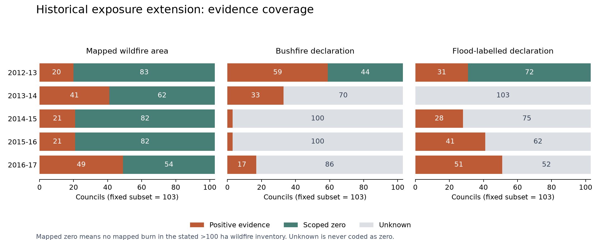

# NSW historical disaster-exposure panel — Version 2 candidate

**Delivered:** 515 additional council-years, covering **2012–13 to 2016–17**, for exactly the **103 continuing councils** selected in fiscal V2. The combined exposure panel has **1,339 rows across 2012–13 to 2024–25**. No models were fitted. The original CSV and all 325 pre-existing repository files were checked by hash and remain unchanged.

## Start here

- **`NSW_Disaster_Exposure_V2_candidate.csv`** — the combined exposure panel. Join to fiscal V2 on `council_key` and `year_start`, never display name.
- **`historical_extension_2012_2016.csv`** — only the 515 newly reconstructed rows.
- **`coverage_by_year.csv` / `historical_coverage.png`** — positive, scoped-zero and unknown counts.
- **`variable_dictionary.csv`** — all 46 panel fields, units and missing-value rules.
- **`declaration_event_ledger.csv` / `declaration_council_links.csv`** — source pages, original dates/names, exclusions and council matches.
- **`temporal_availability_audit.csv`** — event time versus verified availability at a July 1 forecast cutoff.
- **`METHODS_AND_LIMITATIONS.md`** — measurement, timing and comparability decisions.
- **`source_register.csv`, `source_access_attempts.csv`, `validation_checks.json`** — evidence and checks.



## What is genuinely available?

| Exposure year | Mapped-fire positive / scoped zero / unknown | Bushfire declaration positive / scoped zero / unknown | Flood-labelled declaration positive / scoped zero / unknown |
|---|---:|---:|---:|
| 2012–13 | 20 / 83 / 0 | 59 / 44 / 0 | 31 / 72 / 0 |
| 2013–14 | 41 / 62 / 0 | 33 / 0 / 70 | 0 / 0 / 103 |
| 2014–15 | 21 / 82 / 0 | 3 / 0 / 100 | 28 / 0 / 75 |
| 2015–16 | 21 / 82 / 0 | 3 / 0 / 100 | 41 / 0 / 62 |
| 2016–17 | 49 / 54 / 0 | 17 / 0 / 86 | 51 / 0 / 52 |

**Mapped fire:** all five years use actual raster pixel dimensions, the same ABS 2023 council polygons, and low-to-extreme mapped wildfire classes. These historical inventories cover wildfires larger than 100 hectares. A mapped zero means no mapped burn in that scope; it does **not** certify no fire, no small fire, no grassland damage or no council asset damage.

**Declarations:** the 2012–13 Ministry report supplies a complete *published list* of 29 event entries. Its absence codes support scoped administrative zeros. The later Rural Assistance Authority reports provide useful positive evidence, but completeness is not established. Their absent council entries therefore remain **unknown**. Agricultural-only assistance is excluded. Flood includes explicitly flood-labelled compound events; storm-only entries are not automatically floods.

`*_declared` is 1 / 0 / blank. In partial years, positive `*_observed_event_count` values are **lower bounds**. The separate `*_declared_event_count` fields remain blank because complete annual totals are not certified. Blank is never an implied zero. No physical inundation-area series was recovered; `flood_inundated_ha` is unknown throughout.

## Important corrections and limits

The 2016–17 official spreadsheet has an apparent area conversion inconsistency: for 49 positive councils, directly calculated raster hectares are about nine times its labelled hectare values (median ratio **8.993584**). The candidate panel uses direct raster calculations, **not a guessed multiplier**. All 103 mapped-positive/zero classifications agree with the spreadsheet. See `fesm_2016_workbook_reconciliation.csv`.

The latest NEMA download actually starts in 2017, despite catalogue text advertising history from 2006. It was not used to create earlier zeros. Older download links failed; those failures are recorded, not interpreted as absence of disasters.

The fire maps are retrospective products: the older catalogue records were created in 2025 and the 2016–17 report was published in May 2022. No historically available version was certified. Declaration onset dates are not announcement dates; historical announcement and revision dates remain unverified. The extension therefore **does not yet unblock a defensible real-time fiscal forecast experiment**. It does support a richer retrospective exposure description, with the stated missingness and measurement limits. Extra rows alone establish no predictive improvement.

## Reproduce

Cached sources are included under `sources/`. With the packages in `requirements.txt`, run:

```sh
python outputs/disaster_exposure_v2/scripts/process_historical_fire.py
python outputs/disaster_exposure_v2/scripts/build_exposure_v2.py
python outputs/disaster_exposure_v2/scripts/document_exposure_v2.py
```

The raster calculation is the slow step. To rebuild tables from existing zonal statistics, run only the last two commands. All scripts write only within this new output folder. `sources/` also contains unsuccessful retrieval evidence; use `source_register.csv` to distinguish accepted data from failed responses. No existing experiment was rerun.
