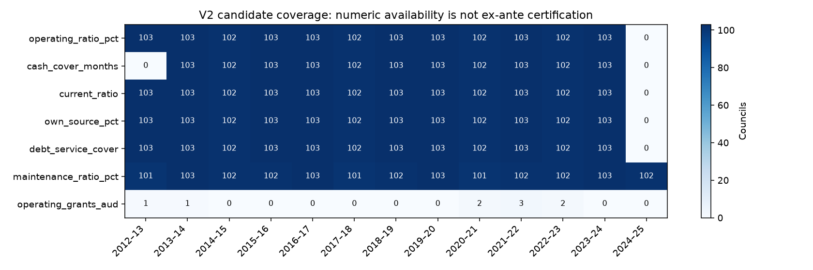

# NSW fiscal panel — Version 2 candidate

**Verdict: NO-GO for immediately rerunning the persistence–ridge–tree experiment.** The historical extension is useful, but it is not yet a verified as-of forecasting dataset. No new models were fitted.

Built 18 September 2026. Start with [GO_NO_GO.md](GO_NO_GO.md), then the [definition audit](definition_changes.md) and [availability audit](temporal_availability_audit.md).

## What was delivered

- **103 continuing councils**, identified by `council_key`; 1,339 council-year rows from 2012–13 to 2024–25.
- **515 additional historical rows**, covering five earlier financial years. Numeric operating-ratio observations: 1,232. The 2024–25 primary target was not collected in the source and remains missing.
- Detailed audited income-statement components for **9 council-years**, including two newly transcribed historical Albury observations. This is a sparse supplementary layer, not statewide component coverage.
- Eight dated statewide advance-grant announcements for target years 2017–18 to 2024–25. Seven have years with observed primary outcomes. Repeating an announcement across councils does not create independent policy variation.
- Seven unresolved maintenance arithmetic conflicts; two documented Albury archive/comparative discrepancies. Earlier cash cover and broader road lengths are retained as raw values but withheld from their common-definition columns.

## Main files

| File | Purpose |
|---|---|
| [NSW_Fiscal_Panel_V2_candidate.csv](NSW_Fiscal_Panel_V2_candidate.csv) | Annual candidate observations; NOT an approved predictor matrix |
| [variable_dictionary.csv](variable_dictionary.csv) | Units, definitions, caveats and roles for every panel column |
| [coverage_by_year_variable.csv](coverage_by_year_variable.csv) | Observed and missing counts, each year and variable |
| [coverage_by_council.csv](coverage_by_council.csv) | Council coverage |
| [coverage_by_forecast_year.csv](coverage_by_forecast_year.csv) | Available fiscal pairs and exposure combinations |
| [council_selection.csv](council_selection.csv) / [council_crosswalk.csv](council_crosswalk.csv) | Included/excluded entities and historical source names |
| [cell_lineage.csv](cell_lineage.csv) / [detailed_component_lineage.csv](detailed_component_lineage.csv) | Workbook cells, units, sources and statement transcriptions |
| [temporal_availability_audit.csv](temporal_availability_audit.csv) | Predictor-by-council-by-target availability decisions |
| [publication_date_audit.csv](publication_date_audit.csv) | Verified release months versus unresolved archive vintages |
| [dated_ex_ante_policy.csv](dated_ex_ante_policy.csv) / [verified_ex_ante_features.csv](verified_ex_ante_features.csv) | Dated announcements, separately from realised fiscal results |
| [potential_forward_folds.csv](potential_forward_folds.csv) | Structural fold counts only; no fitted models |
| [validation_summary.json](validation_summary.json) | Counts and preservation checks |

## Timing and interpretation

For an event financial year **t**, use council characteristics from **t−1** and event exposure during **t** to predict fiscal outcomes in **t+1**. The operational forecast cutoff used here is the start of the target year, **1 July of t+1**. This preserves the previous two-year fiscal lag. It does not presume that a fire map was available merely because the fire had occurred.

The existing expanding-window rule is retained for the eligibility count: training target years must be earlier than `test_target_year − 1`, with at least 100 training rows and two test rows. Fiscal-only history permits eight potential folds; retaining available event exposure permits four, compared with three in the original-period subset. These are optimistic structural counts, not certified backtests.

Any later authorised rerun should compare persistence, ridge and the shallow tree on identical target rows using MAE, RMSE and out-of-sample R², retaining negative R². Fit all preprocessing within training folds. No score or claim of improved accuracy is produced here.

## Reproduction and preservation

Run `python build_panel_v2.py`, then `python write_v2_reports.py`, with pandas, NumPy, matplotlib, xlrd and openpyxl installed. Scripts read the frozen original CSV and the previously cached official OLG workbooks in `../operating_ratio_audit/sources/`; new report sources are cached in `sources/`. Absolute project root is declared near the top of each script. No downloads are needed for this rebuild. Source manifests retain failed retrievals as well as successes; a failed download is not a missing council observation.

All writes are confined to this folder. SHA-256 checks verify **252 prior files unchanged**, including `NSW Data Panel.csv` and prior experiments. The output does not create a composite health index, fill missing exposure with zeros, or splice predecessor councils into amalgamated councils.

