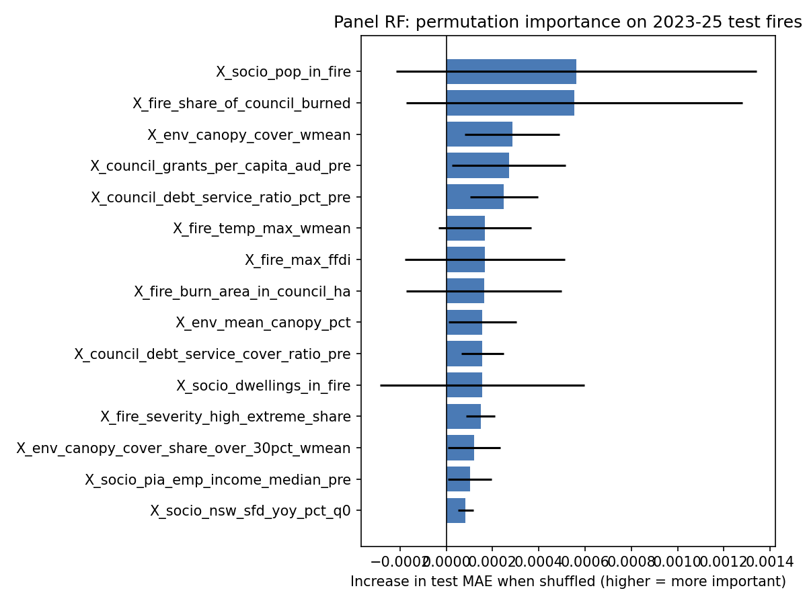
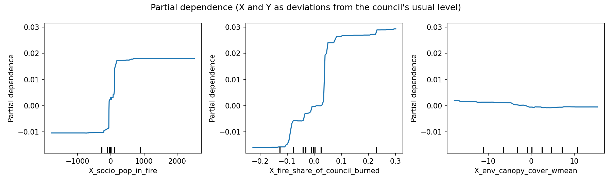
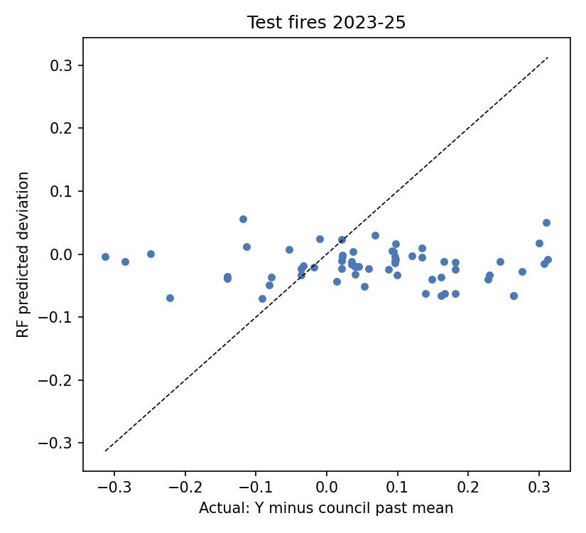

# Experiment 5: panel random forest (within-council, by time)

Panel: **i = council**, **t = each fire the council went through**. Design A: Y and each X are
expressed as the deviation from that council's own mean over its 2015-2019 fires, so fixed council
traits drop out. The model learns *what makes a fire worse than usual for the same council*.
Tested by time: trained on fires starting 2015-2019, tested on fires starting 2023-2025.
Prediction for a test fire = council's past mean + predicted deviation.

## Data review

| | Rows | Councils | Fires |
|---|---:|---:|---:|
| Train (2015-19) | 122 | 40 | 52 |
| Test (2023-25) | 64 | 33 | 41 |

Only councils with 2+ fires and a training-period fire are in the panel. Per-council counts: `results/PANEL_STRUCTURE.csv`.

Predictors: 223 codebook X candidates. 6 excluded and
2948 cells masked by the V2 source-availability registry (data not yet published at the fire date).
Rules fixed before fitting, on training rows only:

| decision                                                    |   columns |
|:------------------------------------------------------------|----------:|
| drop: within-council share < 5% (a council trait, absorbed) |       122 |
| keep                                                        |        80 |
| drop: training coverage < 50%                               |        12 |
| drop: text/categorical (cannot be demeaned)                 |         3 |

**80 predictors kept.** Full list with coverage and within-council share: `results/X_REVIEW.csv`.

## Results on 2023-25 test fires

|                       |   MAE |   RMSE |     R2 |   Spearman(pred,Y) |   Spearman(pred dev,actual dev) |   Class accuracy |   Class 3-4 recall |
|:----------------------|------:|-------:|-------:|-------------------:|--------------------------------:|-----------------:|-------------------:|
| Global training mean  | 0.136 |  0.162 | -0.302 |            nan     |                           0.320 |            0.328 |              0.000 |
| Council own past mean | 0.126 |  0.156 | -0.209 |              0.374 |                         nan     |            0.375 |              0.263 |
| Ridge (within)        | 0.123 |  0.153 | -0.167 |              0.355 |                           0.067 |            0.422 |              0.316 |
| RF (within)           | 0.135 |  0.167 | -0.398 |              0.298 |                          -0.077 |            0.406 |              0.158 |

"Council own past mean" is the key panel baseline: it predicts each council will have its usual Y.
Spearman(pred dev, actual dev) asks whether the model ranks which fires are worse than usual.

RF settings chosen by grouped inner CV: `{'min_samples_leaf': 2, 'max_features': 0.33}`; ridge: `{'alpha': 1000.0}`.
RF predicted deviations range -0.071 to 0.055.

### RF gain in MAE (positive = RF better), 95% bootstrap over test fires

| comparator            |   MAE gain for RF |   CI low |   CI high |
|:----------------------|------------------:|---------:|----------:|
| Global training mean  |            0.0012 |  -0.0233 |    0.0239 |
| Council own past mean |           -0.0088 |  -0.0154 |   -0.0019 |
| Ridge (within)        |           -0.0116 |  -0.0197 |   -0.0048 |

### Level shift in the test years

|   pillars |   test rows |   mean Y above council past mean |
|----------:|------------:|---------------------------------:|
|         2 |      12.000 |                            0.030 |
|         3 |      43.000 |                            0.066 |
|         4 |       9.000 |                            0.093 |

Recent fires have fewer Y pillars (DL is often missing) and a different Y level. Part of any test
error is this shift in how Y is made up, not the fire itself.

## Where the within-council signal comes from

Spearman correlation between a council's deviation in X and its deviation in Y:

|                                |   train 2015-19 |   train excl. Black Summer |   test 2023-25 |   train max |   test max |
|:-------------------------------|----------------:|---------------------------:|---------------:|------------:|-----------:|
| X_socio_pop_in_fire            |           0.633 |                      0.075 |         -0.024 |    3687.895 |    448.839 |
| X_fire_share_of_council_burned |           0.588 |                      0.071 |         -0.050 |       0.762 |      0.103 |
| X_env_canopy_cover_wmean       |          -0.136 |                     -0.357 |         -0.028 |      87.705 |     85.872 |
| X_fire_max_ffdi                |           0.451 |                      0.015 |          0.247 |      90.013 |     53.816 |

Black Summer (declaration 871) is 35 of the 122 training rows.

## Variable importance (permutation on test fires)

| column                                    |   test_MAE_increase |     sd |   impurity_importance |
|:------------------------------------------|--------------------:|-------:|----------------------:|
| X_socio_pop_in_fire                       |              0.0006 | 0.0008 |                0.0654 |
| X_fire_share_of_council_burned            |              0.0006 | 0.0007 |                0.1075 |
| X_env_canopy_cover_wmean                  |              0.0003 | 0.0002 |                0.0082 |
| X_council_grants_per_capita_aud_pre       |              0.0003 | 0.0002 |                0.0154 |
| X_council_debt_service_ratio_pct_pre      |              0.0002 | 0.0001 |                0.0053 |
| X_fire_temp_max_wmean                     |              0.0002 | 0.0002 |                0.0205 |
| X_fire_max_ffdi                           |              0.0002 | 0.0003 |                0.0560 |
| X_fire_burn_area_in_council_ha            |              0.0002 | 0.0003 |                0.0589 |
| X_env_mean_canopy_pct                     |              0.0002 | 0.0001 |                0.0123 |
| X_council_debt_service_cover_ratio_pre    |              0.0002 | 0.0001 |                0.0042 |
| X_socio_dwellings_in_fire                 |              0.0002 | 0.0004 |                0.0499 |
| X_fire_severity_high_extreme_share        |              0.0001 | 0.0001 |                0.0050 |
| X_env_canopy_cover_share_over_30pct_wmean |              0.0001 | 0.0001 |                0.0051 |
| X_socio_pia_emp_income_median_pre         |              0.0001 | 0.0001 |                0.0053 |
| X_socio_nsw_sfd_yoy_pct_q0                |              0.0001 | 0.0000 |                0.0039 |

## Limits

- Y is the workbook's rank-based index built over all 218 rows; it is not rebuilt per split.
- Council means use only training-period fires, so test rows need a 2015-19 fire in the same council.
- Settings and rules were fixed before the test result was seen; nothing was re-tuned afterwards.
- Workbook SHA-256: `123423eaed7174987f72c63cc40ad334e26c636b2e28358f94cf4fcd60c32ec3`.
