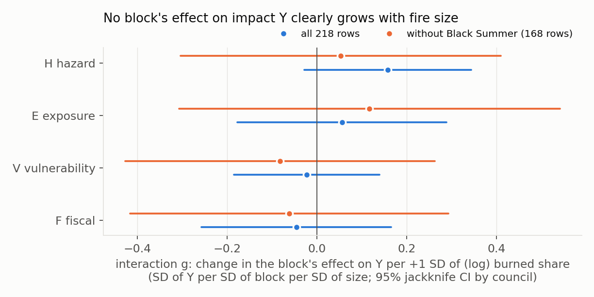
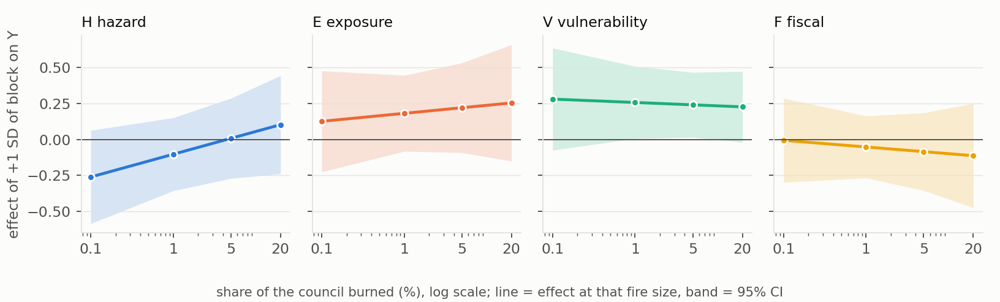
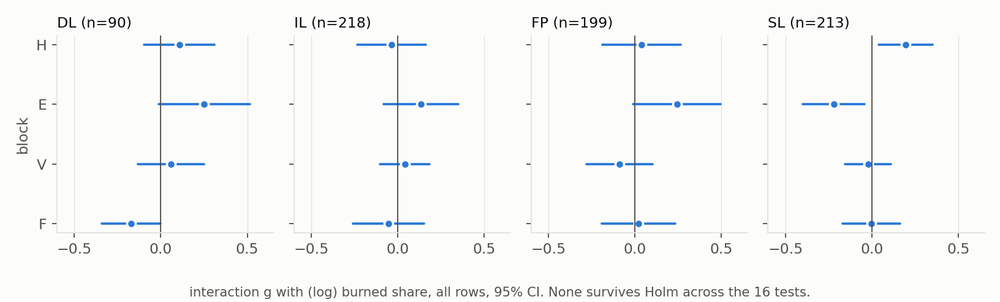

# All-rows continuous analysis: does the pre-fire score's link to impact grow with fire size?

Follow-up to Experiment 6 (`Experiment 6/REPORT.md`, not edited). Written 2026-09-29. Nothing committed or pushed.

## Plain summary (5 lines)

1. **Nothing found.** With all 218 rows and burned share as a continuous term, no block's effect on impact Y grows with fire size: all four interaction intervals include 0 (omnibus p = 0.31), and vulnerability x size is -0.02 [-0.19, +0.14] per 10-fold increase in share burned.
2. **Vulnerability matters about equally at every fire size** (about +0.25 SD of Y per SD of V: +0.28 at 0.1% burned, +0.23 at 20%); the earlier +0.58 on big fires mostly reflects Black Summer councils having a much less spread-out Y, not a steeper slope (post hoc, T12).
3. **The only hint is hazard x size** (+0.16 [-0.03, +0.34] on Y; +0.20 [+0.04, +0.35] on the social pillar SL); it fails correction for testing many effects (Holm p 0.38 and 0.24) and flips sign under raw share, so it is not evidence.
4. **Method checked on shuffled Y:** 2.4-6.1% false alarms (nominal 5%), unbiased, finds an interaction of about 0.2-0.3 SD 80% of the time on all rows; it would miss a sharp effect confined to fires >= 5% a third to a half of the time, and without Black Summer it has little power.
5. **Not an independent test:** these are the same 218 rows that suggested the idea, so a real test needs new fires; the design was fixed and hash-locked before fitting, with one documented pre-fit amendment after the shuffled-Y check.

## What was done

- **Design fixed before any real-Y fit** in the header of [allrows_continuous.py](allrows_continuous.py) (models, targets, what counts as support, what "nothing found" means), hash-locked in [results/PRESPEC_LOCK.txt](results/PRESPEC_LOCK.txt). Before locking, only X-side facts were looked at ([results/DESIGN_DIAGNOSTICS.txt](results/DESIGN_DIAGNOSTICS.txt)): counts, clusters, collinearity (VIF <= 2.6). The script refuses to run if its header changes.
- **Model (primary M1):** OLS on the rank-normal score of Y (Blom, SD 1) with log10 burned share `s` (standardised, floored at 0.01% of a council), the four block scores H, E (v2), V, F (standardised), the four block x size interactions, and event dummies (Black Summer, or start year of the other fires). Coefficients are SD of Y per SD of predictor. `b_B` is a block's effect at an average-size fire within an event; `g_B` is how much that effect changes per +1 SD of size (about a 10-fold change in share).
- **Inference:** delete-one-council jackknife (CR3-type) variance, 95% CI from t with G-1 df (69 councils; 54 without Black Summer). The block x size question is family 1 (4 tests, Holm); the four pillars DL/IL/FP/SL are family 2 (16 tests, Holm).
- **Checks C0-C8** (all also without Black Summer): other size scales (raw share, rank of share, log burn_ha, step >= 5%), one block at a time, fractional logit on raw Y, mixed models (council; council + fire), two-way cluster SE, council fixed effects, council-pairs bootstrap, the composite score `risk_add`.
- **Support rule (fixed in advance):** A jackknife CI for `g_B` above 0; B Holm p < 0.05; C same sign and CI above 0 in at least two of three other size scales; D fractional logit and mixed model both agree; E still above 0 without Black Summer. SUPPORTED = A-E.

### Amendment made before any real-Y fit (read this)

The v1 design (no event dummies, CR1 cluster-robust intervals) was locked at 15:13 ([results/PRESPEC_LOCK_v1.txt](results/PRESPEC_LOCK_v1.txt), code in [amendment_v1_record/](amendment_v1_record)). Its shuffled-Y sanity check failed the pass rule that v1 itself set (2-8% false alarms):

### T8. Same check for the v1 model as first locked (no event dummies, CR1): false-alarm %

| scenario     | sample   |   b_H |   b_E |   b_V |   b_F |   g_H |   g_E |   g_V |   g_F |
|:-------------|:---------|------:|------:|------:|------:|------:|------:|------:|------:|
| null_council | all      |   8.2 |   8.9 |   8.8 |  10.2 |   7.4 |   7.2 |   7.3 |   9.8 |
| null_council | excl_BS  |   8.8 |   8.5 |   9.9 |  12.5 |   8.6 |   9.5 |   8.7 |  10.4 |
| null_full    | all      |   5.5 |   6   |   7.9 |   9   |   7.5 |   9   |   8.2 |   7.7 |
| null_full    | excl_BS  |   7   |   7.6 |   8.5 |  11.9 |   9.2 |   9.9 |   9.9 |  10.6 |
| null_stratum | all      |  25.8 |   6.2 |   6.2 |   7.3 |   9.7 |  13.9 |   8.6 |   8.8 |
| null_stratum | excl_BS  |  16.4 |   6.2 |   5.6 |   9.1 |   8.7 |   9.4 |  13.4 |   9.4 |

CR1 rejects a true null about 5.5-14% of the time for most coefficients (nominal 5%), and under the within-event shuffle `b_H` rejects 26% on all rows and 16% without Black Summer (without event terms the model attributes which events were bad to the hazard block). [inference_calibration.py](inference_calibration.py) compared the alternatives on fake Y only; the only one inside 2-8% everywhere was **event dummies + jackknife**, so v2 made that primary and kept the v1 model as check C0b. **No model had been fitted to the real Y** at that point (only shuffled Y and Y's intra-council correlation, 0.325, were used); v1 code and lock are preserved, so this can be checked. The consequence is visible in T3a/T4 below: the v1 model would have shown omnibus p = 0.038 and `g_H` = +0.20 [+0.03, +0.36]. That is the false-alarm-prone version; even so, it would not have met rule B (Holm p about 0.08).

## Sanity check (fake Y only; [sanity_check.py](sanity_check.py), [results/SANITY_CHECK.csv](results/SANITY_CHECK.csv))

Real X, fake Y. Nulls: Y shuffled within Black Summer and within start year (keeps event levels), Y shuffled over all rows, and Y with council-persistent noise at the real intra-council correlation. 2,000 simulations each.

### T7. Sanity check, v2 primary model: false-alarm % on a true null (nominal 5)

| scenario     | sample   |   b_H |   b_E |   b_V |   b_F |   g_H |   g_E |   g_V |   g_F |   omnibus_g |
|:-------------|:---------|------:|------:|------:|------:|------:|------:|------:|------:|------------:|
| null_council | all      |   4.1 |   4   |   5.1 |   5.1 |   2.9 |   3.9 |   3.5 |   3.9 |         5.2 |
| null_council | excl_BS  |   3.7 |   3.4 |   5   |   5.4 |   2.6 |   2.4 |   2.6 |   2.9 |         4   |
| null_full    | all      |   4   |   4.8 |   3.9 |   4.7 |   2.9 |   3.2 |   3.6 |   4   |         6.1 |
| null_full    | excl_BS  |   3.6 |   2.6 |   3.7 |   4.4 |   3.8 |   3.2 |   4   |   3.2 |         5.6 |
| null_stratum | all      |   3.6 |   3.7 |   4   |   3.8 |   3.3 |   3.6 |   4   |   3.4 |         5.3 |
| null_stratum | excl_BS  |   3.4 |   3.4 |   3.4 |   3.6 |   3.5 |   2.8 |   3.5 |   3.2 |         5.1 |

All 54 cells sit at 2.4-6.1% (pass rule 2-8%, none flagged), including the omnibus test.

Planted effects (1,000 simulations per cell; `g` is SD of Y per SD of block per SD of size, all other coefficients truly 0):

### T9. Planted interaction (fake Y): bias and power, M1 primary

| block   |   true g |   bias (all) |   power % (all) |   Holm power % (all) |   bias (excl_BS) |   power % (excl_BS) |   Holm power % (excl_BS) |
|:--------|---------:|-------------:|----------------:|---------------------:|-----------------:|--------------------:|-------------------------:|
| H       |     0.05 |         0.95 |               6 |                    3 |             0.97 |                   4 |                        1 |
| H       |     0.1  |         0.98 |              17 |                    7 |             0.98 |                   9 |                        3 |
| H       |     0.14 |         0.98 |              35 |                   18 |             0.99 |                  17 |                        7 |
| H       |     0.19 |         0.99 |              56 |                   36 |             0.99 |                  28 |                       14 |
| H       |     0.29 |         0.99 |              92 |                   78 |             1    |                  57 |                       35 |
| E       |     0.05 |         1.06 |               6 |                    2 |             1.03 |                   4 |                        1 |
| E       |     0.11 |         1.03 |              15 |                    6 |             1.01 |                   8 |                        2 |
| E       |     0.16 |         1.02 |              33 |                   14 |             1.01 |                  15 |                        6 |
| E       |     0.21 |         1.01 |              50 |                   31 |             1.01 |                  24 |                       11 |
| E       |     0.32 |         1.01 |              87 |                   70 |             1    |                  53 |                       30 |
| V       |     0.05 |         0.98 |              10 |                    3 |             1    |                   4 |                        1 |
| V       |     0.1  |         0.99 |              26 |                   13 |             1    |                   9 |                        2 |
| V       |     0.14 |         0.99 |              52 |                   30 |             1    |                  17 |                        7 |
| V       |     0.19 |         0.99 |              77 |                   58 |             1    |                  31 |                       14 |
| V       |     0.29 |         1    |              99 |                   96 |             1    |                  60 |                       39 |
| F       |     0.05 |         0.99 |               7 |                    2 |             0.95 |                   4 |                        1 |
| F       |     0.11 |         0.99 |              23 |                   10 |             0.98 |                  12 |                        4 |
| F       |     0.16 |         1    |              48 |                   27 |             0.98 |                  25 |                       11 |
| F       |     0.21 |         1    |              74 |                   52 |             0.99 |                  44 |                       23 |
| F       |     0.32 |         1    |              98 |                   92 |             0.99 |                  82 |                       62 |

- **Unbiased:** mean estimate / true value 0.95-1.06.
- **Power on all rows:** at `g` about 0.2, 50-77% (unadjusted); at about 0.3, 87-99%. Smallest `g` found at 80% power: V 0.21, F 0.24, H 0.26, E 0.30 (with Holm: V 0.25, F 0.29; H and E do not reach 80% by 0.3).
- **Without Black Summer the design is weak:** 53-60% power even at `g` about 0.3 (F 82%). A non-significant result there is not evidence of no effect.
- **A constant effect does not produce a fake interaction:** with a size-independent effect planted on V or F, the false-alarm rate of `g` stayed at about 4% (all rows) and 3% (without Black Summer); the size-independent `b` was found 74-80% (all rows, effect 0.2) and 98-99% (0.3).

### T10. Smallest interaction g detected at 80% power

| block   | sample   | rule       | mde                        | at max g tested   |
|:--------|:---------|:-----------|:---------------------------|:------------------|
| H       | all      | unadjusted | 0.26                       | 92% at g=0.29     |
| H       | all      | Holm       | not reached (max g tested) | 78% at g=0.29     |
| H       | excl_BS  | unadjusted | not reached (max g tested) | 57% at g=0.29     |
| H       | excl_BS  | Holm       | not reached (max g tested) | 35% at g=0.29     |
| E       | all      | unadjusted | 0.30                       | 87% at g=0.32     |
| E       | all      | Holm       | not reached (max g tested) | 70% at g=0.32     |
| E       | excl_BS  | unadjusted | not reached (max g tested) | 53% at g=0.32     |
| E       | excl_BS  | Holm       | not reached (max g tested) | 30% at g=0.32     |
| V       | all      | unadjusted | 0.21                       | 99% at g=0.29     |
| V       | all      | Holm       | 0.25                       | 96% at g=0.29     |
| V       | excl_BS  | unadjusted | not reached (max g tested) | 60% at g=0.29     |
| V       | excl_BS  | Holm       | not reached (max g tested) | 39% at g=0.29     |
| F       | all      | unadjusted | 0.24                       | 98% at g=0.32     |
| F       | all      | Holm       | 0.29                       | 92% at g=0.32     |
| F       | excl_BS  | unadjusted | 0.31                       | 82% at g=0.32     |
| F       | excl_BS  | Holm       | not reached (max g tested) | 62% at g=0.32     |

### T11. Threshold-shaped effect (only fires >= 5% burned) planted in fake Y: power of the continuous model

| planted on   |   r within >=5% rows |   g detected % (all) |   g Holm % (all) |   omnibus % (all) |   g detected % (excl_BS) |   g Holm % (excl_BS) |   omnibus % (excl_BS) |
|:-------------|---------------------:|---------------------:|-----------------:|------------------:|-------------------------:|---------------------:|----------------------:|
| V            |                  0.2 |                   11 |                4 |                 9 |                        2 |                    0 |                     5 |
| V            |                  0.4 |                   31 |               16 |                23 |                        4 |                    0 |                     6 |
| V            |                  0.6 |                   64 |               41 |                49 |                        5 |                    1 |                     7 |
| F            |                  0.2 |                    6 |                2 |                 9 |                        2 |                    1 |                     5 |
| F            |                  0.4 |                   19 |                7 |                14 |                        3 |                    1 |                     5 |
| F            |                  0.6 |                   38 |               18 |                26 |                        4 |                    1 |                     5 |

The last table is the caveat that matters for reading the null: a **threshold-shaped V effect confined to fires >= 5%**, as strong as the Experiment 6 +0.58, is picked up by this model only 64% of the time (41% after Holm), because 30 of those 38 rows are Black Summer and the Black Summer event dummy absorbs part of it. So "no growth" is a statement about smooth log-size dependence with event levels removed; a sharp effect confined to Black Summer would be missed a third to a half of the time.

## Results

### Target Y (primary)

### T1. Primary model M1, target Y

| term                      | all 218 rows         |    p | without Black Summer (168)   |   p  |
|:--------------------------|:---------------------|-----:|:-----------------------------|-----:|
| size s (log burned share) | +0.06 [-0.16, +0.29] | 0.57 | +0.01 [-0.29, +0.31]         | 0.94 |
| b_H                       | -0.13 [-0.39, +0.12] | 0.3  | -0.23 [-0.62, +0.15]         | 0.23 |
| b_E                       | +0.17 [-0.10, +0.44] | 0.21 | +0.24 [-0.14, +0.61]         | 0.22 |
| b_V                       | +0.26 [-0.01, +0.53] | 0.06 | +0.24 [-0.16, +0.64]         | 0.23 |
| b_F                       | -0.04 [-0.26, +0.17] | 0.69 | -0.07 [-0.41, +0.28]         | 0.7  |
| g_H (H x size)            | +0.16 [-0.03, +0.34] | 0.1  | +0.05 [-0.30, +0.41]         | 0.77 |
| g_E (E x size)            | +0.06 [-0.18, +0.29] | 0.64 | +0.12 [-0.31, +0.54]         | 0.58 |
| g_V (V x size)            | -0.02 [-0.19, +0.14] | 0.77 | -0.08 [-0.43, +0.26]         | 0.63 |
| g_F (F x size)            | -0.05 [-0.26, +0.17] | 0.66 | -0.06 [-0.42, +0.29]         | 0.73 |

Omnibus test that all four g = 0: all rows: F(4,68) = 1.22, p = 0.31; without Black Summer: F(4,53) = 0.44, p = 0.78

Reading: **no interaction is distinguishable from 0.** The largest is H x size at +0.16 (p = 0.10, Holm 0.38). V x size is essentially zero (-0.02, and the upper limit +0.14 is below the 0.21 the design could reliably detect). Block main effects (`b`) are also weak: the largest is V at an average-size fire (+0.26, interval just includes 0).

### T2. Effect of +1 SD of a block on Y at a given burned share (M1, all rows)

| block   | 0.1% burned          | 1% burned            | 5% burned            | 20% burned           |
|:--------|:---------------------|:---------------------|:---------------------|:---------------------|
| H       | -0.26 [-0.59, +0.06] | -0.10 [-0.36, +0.15] | +0.01 [-0.27, +0.29] | +0.10 [-0.24, +0.44] |
| E       | +0.13 [-0.23, +0.48] | +0.18 [-0.08, +0.45] | +0.22 [-0.09, +0.53] | +0.25 [-0.15, +0.66] |
| V       | +0.28 [-0.07, +0.64] | +0.26 [+0.01, +0.51] | +0.24 [+0.01, +0.47] | +0.23 [-0.02, +0.47] |
| F       | -0.01 [-0.30, +0.29] | -0.05 [-0.27, +0.16] | -0.09 [-0.36, +0.19] | -0.11 [-0.48, +0.25] |

V's effect is about +0.25 at every size; the interval just excludes 0 at 1% and 5% burned (lower limit +0.01) and includes 0 at 0.1% and 20%. H's effect rises from -0.26 to +0.10 across sizes but every interval includes 0.

### Robustness (target Y)

### T3a. Interaction g in every model, target Y, all 218 rows

| model                                           | g_H                  | g_E                  | g_V                  | g_F                  |
|:------------------------------------------------|:---------------------|:---------------------|:---------------------|:---------------------|
| M1 primary (event dummies, jackknife)           | +0.16 [-0.03, +0.34] | +0.06 [-0.18, +0.29] | -0.02 [-0.19, +0.14] | -0.05 [-0.26, +0.17] |
| C0b: v1 as first locked (no event dummies, CR1) | +0.20 [+0.03, +0.36] | +0.10 [-0.08, +0.29] | -0.00 [-0.14, +0.13] | -0.07 [-0.23, +0.09] |
| C0a: no event dummies, jackknife                | +0.20 [+0.00, +0.39] | +0.10 [-0.13, +0.34] | -0.00 [-0.19, +0.18] | -0.07 [-0.28, +0.14] |
| C1: raw share                                   | -0.25 [-0.62, +0.13] | +0.08 [-0.27, +0.43] | -0.03 [-0.17, +0.11] | -0.01 [-0.16, +0.14] |
| C1: rank of share                               | +0.20 [+0.00, +0.39] | +0.02 [-0.21, +0.24] | -0.01 [-0.17, +0.16] | -0.07 [-0.28, +0.15] |
| C1: log burn ha                                 | +0.07 [-0.10, +0.25] | +0.02 [-0.20, +0.25] | +0.00 [-0.16, +0.16] | -0.01 [-0.24, +0.21] |
| C1: step share >= 5%                            | +0.24 [-0.27, +0.75] | +0.22 [-0.31, +0.75] | -0.08 [-0.49, +0.33] | -0.02 [-0.55, +0.51] |
| C3: fractional logit (log-odds)                 | +0.10 [-0.02, +0.21] | +0.03 [-0.11, +0.18] | -0.01 [-0.11, +0.09] | -0.03 [-0.16, +0.09] |
| C4: mixed, council random intercept             | +0.19 [+0.05, +0.34] | +0.02 [-0.14, +0.19] | -0.00 [-0.12, +0.12] | -0.02 [-0.18, +0.14] |
| C4b: mixed, crossed council + fire              | +0.19 [+0.05, +0.33] | +0.02 [-0.15, +0.19] | -0.00 [-0.12, +0.11] | -0.02 [-0.15, +0.11] |
| C5: two-way cluster (council, fire)             | +0.16 [+0.01, +0.31] | +0.06 [-0.10, +0.21] | -0.02 [-0.15, +0.10] | -0.05 [-0.22, +0.12] |
| C6: council fixed effects                       | +0.24 [+0.04, +0.44] | -0.03 [-0.23, +0.17] | +0.08 [-0.06, +0.22] | -0.05 [-0.22, +0.13] |
| C7: council-pairs bootstrap                     | +0.16 [-0.01, +0.33] | +0.06 [-0.14, +0.28] | -0.02 [-0.15, +0.12] | -0.05 [-0.25, +0.13] |
| C2: one block at a time                         | +0.16 [-0.01, +0.34] | +0.17 [-0.03, +0.36] | -0.01 [-0.13, +0.11] | +0.02 [-0.22, +0.26] |
| C8: composite score risk_add (g on the score)   | +0.13 [-0.03, +0.29] |                      |                      |                      |

### T3b. Interaction g in every model, target Y, without Black Summer (168 rows)

| model                                           | g_H                  | g_E                    | g_V                    | g_F                    |
|:------------------------------------------------|:---------------------|:-----------------------|:-----------------------|:-----------------------|
| M1 primary (event dummies, jackknife)           | +0.05 [-0.30, +0.41] | +0.12 [-0.31, +0.54]   | -0.08 [-0.43, +0.26]   | -0.06 [-0.42, +0.29]   |
| C0b: v1 as first locked (no event dummies, CR1) | +0.08 [-0.17, +0.33] | +0.16 [-0.13, +0.45]   | -0.04 [-0.30, +0.22]   | -0.09 [-0.34, +0.16]   |
| C0a: no event dummies, jackknife                | +0.08 [-0.26, +0.42] | +0.16 [-0.25, +0.57]   | -0.04 [-0.38, +0.30]   | -0.09 [-0.46, +0.27]   |
| C1: raw share                                   | +0.95 [-4.19, +6.10] | +0.24 [-2.57, +3.06]   | -0.16 [-3.39, +3.06]   | -0.05 [-5.25, +5.15]   |
| C1: rank of share                               | +0.09 [-0.26, +0.45] | +0.07 [-0.32, +0.46]   | -0.02 [-0.35, +0.31]   | -0.10 [-0.43, +0.23]   |
| C1: log burn ha                                 | +0.01 [-0.26, +0.28] | +0.00 [-0.37, +0.38]   | -0.03 [-0.28, +0.22]   | -0.01 [-0.41, +0.39]   |
| C1: step share >= 5%                            | +0.70 [-3.58, +4.98] | +0.18 [-16.38, +16.73] | -0.53 [-16.11, +15.05] | +0.85 [-12.08, +13.78] |
| C3: fractional logit (log-odds)                 | +0.03 [-0.18, +0.24] | +0.08 [-0.17, +0.33]   | -0.05 [-0.25, +0.15]   | -0.04 [-0.25, +0.16]   |
| C4: mixed, council random intercept             | +0.10 [-0.13, +0.32] | +0.02 [-0.26, +0.30]   | -0.10 [-0.37, +0.16]   | +0.00 [-0.24, +0.25]   |
| C4b: mixed, crossed council + fire              | +0.10 [-0.14, +0.33] | +0.02 [-0.24, +0.27]   | -0.10 [-0.30, +0.09]   | +0.00 [-0.18, +0.19]   |
| C5: two-way cluster (council, fire)             | +0.05 [-0.19, +0.30] | +0.12 [-0.15, +0.39]   | -0.08 [-0.34, +0.17]   | -0.06 [-0.32, +0.19]   |
| C6: council fixed effects                       | +0.11 [-0.25, +0.47] | -0.06 [-0.60, +0.47]   | -0.06 [-0.66, +0.53]   | +0.02 [-0.25, +0.29]   |
| C7: council-pairs bootstrap                     | +0.05 [-0.28, +0.33] | +0.12 [-0.22, +0.49]   | -0.08 [-0.34, +0.27]   | -0.06 [-0.35, +0.21]   |
| C2: one block at a time                         | +0.11 [-0.18, +0.40] | +0.20 [-0.09, +0.49]   | -0.00 [-0.25, +0.24]   | -0.01 [-0.42, +0.39]   |
| C8: composite score risk_add (g on the score)   | +0.12 [-0.16, +0.40] |                        |                        |                        |

### T4. Omnibus p (all four g = 0), target Y

| model                           | all rows   | without Black Summer   |
|:--------------------------------|:-----------|:-----------------------|
| M1 primary                      | p = 0.312  | p = 0.778              |
| C0b v1 as first locked          | p = 0.038  | p = 0.421              |
| C0a no event dummies, jackknife | p = 0.104  | p = 0.666              |
| raw share                       | p = 0.756  | p = 0.820              |
| rank of share                   | p = 0.182  | p = 0.741              |
| log burn ha                     | p = 0.905  | p = 0.995              |
| step >= 5%                      | p = 0.688  | p = 0.996              |

- The H x size sign is **not robust**: positive for share (log), rank of share, log burn_ha, step and the model-class checks, **negative for raw share** (-0.25 [-0.62, +0.13]). E, V and F interactions are close to 0 in every model.
- Only H x size ever gets an interval above 0 (C0a/C0b, rank of share, mixed models, two-way cluster, council fixed effects +0.24 [+0.04, +0.44]), never under the primary jackknife with event dummies and never surviving Holm.
- Raw-share and step columns without Black Summer have huge intervals because share barely varies outside Black Summer relative to its all-rows SD; they carry no information.
- The composite score `risk_add` (C8): level +0.20 [+0.01, +0.38] at an average-size fire, interaction +0.13 [-0.03, +0.29]: a modest positive link at all sizes, not clearly growing.
- The fractional logit column (C3) is on the log-odds scale, not directly comparable in size, only in sign.

### Verdicts

### T5. Verdicts, target Y (rule in the header of allrows_continuous.py)

| block   | g (95% CI)           |    p |   Holm p | A   | B   | C   | D   | E   | without BS           | verdict       |
|:--------|:---------------------|-----:|---------:|:----|:----|:----|:----|:----|:---------------------|:--------------|
| H       | +0.16 [-0.03, +0.34] | 0.1  |     0.38 | no  | no  | no  | no  | no  | +0.05 [-0.30, +0.41] | NOT SUPPORTED |
| E       | +0.06 [-0.18, +0.29] | 0.64 |     1    | no  | no  | no  | no  | no  | +0.12 [-0.31, +0.54] | NOT SUPPORTED |
| V       | -0.02 [-0.19, +0.14] | 0.77 |     1    | no  | no  | no  | no  | no  | -0.08 [-0.43, +0.26] | NOT SUPPORTED |
| F       | -0.05 [-0.26, +0.17] | 0.66 |     1    | no  | no  | no  | no  | no  | -0.06 [-0.42, +0.29] | NOT SUPPORTED |

Rule A fails for every block, so every block is **NOT SUPPORTED** on Y. Without Black Summer (last-but-one column) point estimates are similar and intervals about twice as wide, as the sanity check predicted.

### Pillars (secondary, family of 16)

### T6. Pillars: g_B of M1 on all rows, Holm across all 16

| target   |   n | block   | g (95% CI)           |     p |   Holm p (of 16) | verdict       |
|:---------|----:|:--------|:---------------------|------:|-----------------:|:--------------|
| DL       |  90 | H       | +0.11 [-0.10, +0.31] | 0.301 |             1    | NOT SUPPORTED |
| DL       |  90 | E       | +0.25 [-0.01, +0.51] | 0.061 |             0.79 | NOT SUPPORTED |
| DL       |  90 | V       | +0.06 [-0.13, +0.25] | 0.545 |             1    | NOT SUPPORTED |
| DL       |  90 | F       | -0.17 [-0.34, -0.00] | 0.048 |             0.67 | CONTRADICTED  |
| IL       | 218 | H       | -0.04 [-0.23, +0.16] | 0.723 |             1    | NOT SUPPORTED |
| IL       | 218 | E       | +0.13 [-0.08, +0.35] | 0.219 |             1    | NOT SUPPORTED |
| IL       | 218 | V       | +0.04 [-0.10, +0.18] | 0.573 |             1    | NOT SUPPORTED |
| IL       | 218 | F       | -0.05 [-0.26, +0.15] | 0.609 |             1    | NOT SUPPORTED |
| FP       | 199 | H       | +0.04 [-0.19, +0.27] | 0.728 |             1    | NOT SUPPORTED |
| FP       | 199 | E       | +0.24 [-0.01, +0.50] | 0.061 |             0.79 | NOT SUPPORTED |
| FP       | 199 | V       | -0.09 [-0.28, +0.10] | 0.362 |             1    | NOT SUPPORTED |
| FP       | 199 | F       | +0.02 [-0.19, +0.23] | 0.836 |             1    | NOT SUPPORTED |
| SL       | 213 | H       | +0.20 [+0.04, +0.35] | 0.015 |             0.24 | SUGGESTIVE    |
| SL       | 213 | E       | -0.22 [-0.40, -0.04] | 0.016 |             0.24 | CONTRADICTED  |
| SL       | 213 | V       | -0.02 [-0.15, +0.11] | 0.738 |             1    | NOT SUPPORTED |
| SL       | 213 | F       | -0.00 [-0.17, +0.16] | 0.966 |             1    | NOT SUPPORTED |

Sixteen tests, three nominally below 0.05 (SL x H +0.20, SL x E -0.22, DL x F -0.17), against 0.8 expected by chance. None is close after Holm (smallest adjusted p = 0.24); SL x H is the only one labelled SUGGESTIVE (A and D hold; B and C fail). The H and E effects on SL have opposite signs and H and E are correlated (Spearman 0.51 across rows), so this is at least as likely to be collinearity trading between the two as a real pattern. DL has only 90 rows (50 Black Summer).

## Post hoc: how this fits the earlier +0.58 (not part of the locked test)

Chosen after seeing the locked results, so context, not a test ([posthoc_v_by_event.py](posthoc_v_by_event.py)).

### T12. POST HOC (not part of the locked test): V vs Y by event and size band

| group                      |   rows |   councils | Spearman V-Y (95% CI)   |   slope |   SD of Y* |   resid SD |
|:---------------------------|-------:|-----------:|:------------------------|--------:|-----------:|-----------:|
| all rows                   |    218 |         69 | +0.25 [+0.06, +0.43]    |    0.26 |       1    |       0.97 |
| Black Summer (50)          |     50 |         50 | +0.55 [+0.32, +0.71]    |    0.37 |       0.86 |       0.78 |
| all other fires (168)      |    168 |         54 | +0.21 [-0.03, +0.44]    |    0.24 |       1.03 |       1.01 |
| share >= 5% (Exp 6 subset) |     38 |         34 | +0.58 [+0.31, +0.76]    |    0.39 |       0.94 |       0.84 |
| share >= 5%, Black Summer  |     30 |         30 | +0.61 [+0.34, +0.80]    |    0.28 |       0.69 |       0.63 |
| share >= 5%, other fires   |      8 |          7 | +0.51 [-0.38, +0.96]    |    0.61 |       1.42 |       1.21 |
| share < 5%                 |    180 |         60 | +0.20 [-0.02, +0.41]    |    0.22 |       0.99 |       0.97 |
| share < 5%, Black Summer   |     20 |         20 | +0.40 [-0.08, +0.74]    |    0.24 |       0.76 |       0.75 |
| share < 5%, other fires    |    160 |         52 | +0.17 [-0.06, +0.42]    |    0.2  |       1.01 |       1    |
| share 1-5%                 |     45 |         26 | +0.33 [-0.02, +0.58]    |    0.42 |       1.05 |       1    |
| share < 1%                 |    135 |         53 | +0.18 [-0.07, +0.43]    |    0.19 |       0.97 |       0.96 |

### T13. POST HOC: V x size in simpler settings (Y, jackknife)

| model                                            |   rows | g_V (95% CI)         |    p |
|:-------------------------------------------------|-------:|:---------------------|-----:|
| V only, no event dummies                         |    218 | +0.03 [-0.09, +0.16] | 0.61 |
| V only, event dummies                            |    218 | -0.01 [-0.13, +0.11] | 0.9  |
| four blocks, no event dummies                    |    218 | -0.00 [-0.19, +0.18] | 0.96 |
| four blocks, event dummies (= locked primary)    |    218 | -0.02 [-0.19, +0.14] | 0.77 |
| V only, no event dummies, excluding Black Summer |    168 | +0.06 [-0.20, +0.33] | 0.63 |

- The Experiment 6 numbers are reproduced (+0.25 all rows, +0.58 on >= 5%).
- **Black Summer carries it:** V-Y Spearman is +0.55 across the 50 Black Summer councils and +0.21 across the other 168 rows.
- **Correlation rises with fire size, the slope does not clearly:** correlations go +0.18 (<1%), +0.33 (1-5%), +0.58 (>= 5%), but the plain slope of Y* on V is 0.19, 0.42, 0.39, and within Black Summer it is 0.24 for < 5% burned and 0.28 for >= 5%. What differs is how spread out Y is: SD of Y* is only 0.69 among large-fire Black Summer councils versus about 1.0 elsewhere, which raises a correlation without a steeper slope.
- A smooth log-size interaction for V alone is about zero even in the simplest settings (T13).
- The 8 large fires outside Black Summer have a wide interval (+0.51 [-0.38, +0.96]) and cannot settle anything.

## Limits and things to know

1. **Same rows as the hypothesis.** The idea that V's effect grows with size came from these 218 rows in Experiment 6. A fresh test needs new fires (other years or states); the follow-up cannot substitute for that.
2. **Event dummies change the question.** With them, `g_B` compares councils within the same event (Black Summer, or same start year) that were burned to different degrees. Between-event contrasts (Black Summer versus everything else) are removed on purpose, because the shuffled-Y check showed they leak into the coefficients. C0a/C0b give the no-event-dummy versions.
3. **Black Summer is 50 of 218 rows and 30 of the 38 rows >= 5%.** Without it there are 8 rows >= 5% and power is low (T9-T11), so the "without Black Summer" column mostly says the data are silent.
4. **Y is a within-sample rank composite;** rank-normal scores treat it as ordinal. Y has DL for only 90 rows; DL results rest on 90 rows.
5. **Calibration covers the primary model only.** The GLM, mixed, two-way and bootstrap checks were not simulated; they are checks on sign and size, and rule D uses jackknife intervals for the GLM and mixed model.
6. **Small things logged** ([results/RUN_NOTES.txt](results/RUN_NOTES.txt)): in the FP mixed model one leave-one-council-out refit failed in each sample and contributes a zero difference (FP verdicts are NOT SUPPORTED regardless); the two-way cluster variance was not positive semi-definite and was eigenvalue-clipped (standard fix); crossed mixed models converged (fire variance about 0). A tuple-coding bug in the two-way clustering code was found and fixed in a dry run on shuffled Y before locking.
7. **Deviations from the pre-specification:** the single v1 -> v2 amendment above (before any real fit). The post hoc script, figures and tables were added after the locked run and are labelled.
8. **Multiplicity:** 4 tests for Y (Holm), 16 for pillars (Holm); checks and simple slopes are unadjusted.

## Files (all under `Experiment 6/followups/allrows_continuous/`)

| Item | Where |
|---|---|
| Pre-specification (v2), analysis | `allrows_continuous.py` (header = spec), `arc_lib.py` |
| Sanity check (spec in header) | `sanity_check.py` -> `results/SANITY_CHECK.csv`, `SANITY_MDE.csv`, `sanity.log` |
| Design diagnostics (X only) | `design_diagnostics.py` -> `results/DESIGN_DIAGNOSTICS.txt` |
| Lock | `lock_prespec.py`, `results/PRESPEC_LOCK.txt` (v2), `results/PRESPEC_LOCK_v1.txt` |
| v1 record | `amendment_v1_record/`, `results/sanity_v1/` (v1 sanity, calibration of CR1 vs jackknife), `inference_calibration.py` |
| Real results | `results/ALLROWS_MODELS.csv` (every coefficient), `OMNIBUS.csv`, `SIMPLE_SLOPES.csv`, `VERDICTS.csv`, `run.log` |
| Post hoc | `posthoc_v_by_event.py` -> `results/POSTHOC_*.csv` |
| Figures, tables | `make_figures.py` -> `results/fig*.png`; `build_findings_tables.py` -> `results/FINDINGS_TABLES.md` |
| Input snapshot | `inputs/ROWS_WITH_SCORE_v2.csv` (copy of the Experiment 6 file; sha256 in `results/INPUT_SHA256.txt`) |

Run order: `design_diagnostics.py`, `lock_prespec.py`, `sanity_check.py`, `allrows_continuous.py` (about 30 s), then `posthoc_v_by_event.py`, `make_figures.py`, `build_findings_tables.py`. Seeds: bootstrap 20260929, simulations 20260930. No new downloads; sources are only the Experiment 6 result file.
