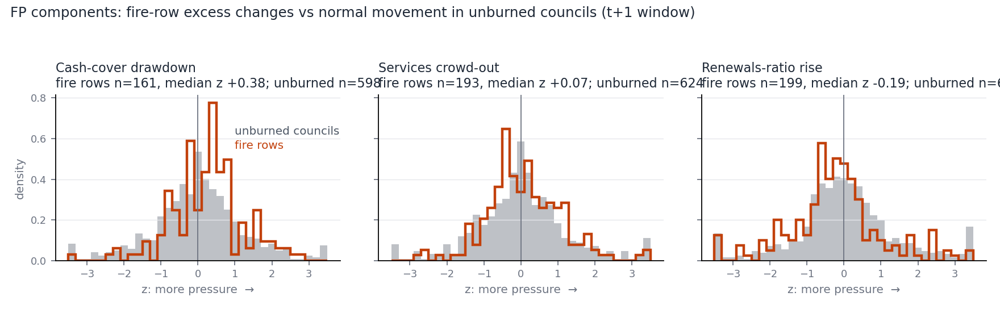

# FP outcome follow-up: audit of the fiscal-pressure pillar and three alternative definitions

2026-09-29. Read-only on Experiment 6 and the dataset; `Experiment 6/REPORT.md` is untouched. Nothing committed.

## Summary in five lines

1. **The old FP is mostly normal budget movement.** In fire councils its three ingredients vary about as much as the same ratios do in unburned councils (76-87% of fire rows sit inside the unburned 10th-90th percentile band; 80% would if fire changed nothing), and the three ingredients do not agree (average pairwise Spearman -0.04).
2. **One ingredient points the wrong way.** NSW OLG treats a *higher* renewals ratio as good; after a fire a rise mostly means rebuilding, yet FP counts it as pressure. Services-share "crowd-out" moves *against* cash drawdown (-0.21), which also fits recovery spending.
3. **Three literature-based alternatives were frozen before any test** (hash in `results/FROZEN.txt`): cash-cover drawdown alone; operating-result shock alone; a composite of cash drawdown, operating result and own-source revenue in which grants are never counted as a loss.
4. **Nothing improves.** None responds more clearly to damage (burned share, DL) or relates better to the pre-fire fiscal (F) and vulnerability (V) blocks than the old FP: 0 of 36 paired comparisons excluded zero, all six verdicts are "no clear change".
5. **So nothing changes.** The data cannot tell a better FP from the old one; intervals are wide (about +/-0.15 on all rows, +/-0.3 on fires burning 5% or more), so small effects cannot be ruled out. Choosing between definitions rests on construct and literature grounds, not on these results.

## 1. What FP is, and what each ingredient measures

FP = mean of three percentile ranks over the 218 rows. Each input is an *excess* change (council change minus the median change over the same period in NSW councils with no fire of 100 ha or more inside). I rebuilt FP and all three ranks from the raw columns: maximum difference 6e-17. I also reproduced the dataset's excess rule from the OLG panel: all six master columns tested match to 1e-13 (`fpcommon.py`), so the same rule can be applied to other ratios.

| Ingredient | Measures | Good direction per OLG | How FP scores it | Problem |
|---|---|---|---|---|
| Cash drawdown (mean of excess in FY t and t+1) | Change in cash expense cover, months of spending covered | Higher is good (benchmark above 3 months) | Fall = pressure | Clear sign. OLG's published formula does not mention excluding restricted cash, so grants held in restricted funds probably count (the Audit Office's 2018 local government report implies the same, per the helper agent; not confirmed). The workbook codebook says "unrestricted cash"; that wording looks wrong and is worth checking. Mixes horizons: 38 rows (FY2023 fires) have only year t |
| Services crowd-out (t+1) | Change in the share of spending on community services, recreation and environment | Not an OLG benchmark | Fall = pressure | A composition ratio. Grant-funded roads repair raises the denominator and lowers the share with no cut to services |
| Renewals-ratio rise (t+1) | Change in asset renewal spending / depreciation | Higher is good (above 100% satisfactory) | **Rise = pressure** | **Sign-ambiguous, arguably reversed.** A rise after a fire is asset replacement. Lumpy: 10% of fire rows have an excess beyond 100 pp; mean reversion -0.32 |

## 2. Audit results (`audit_fp.py` -> `results/AUDIT*.csv`, `AUDIT.txt`; figure `results/audit_noise.png`)

Run before the alternatives were frozen. No damage, DL, F or V was used.

**Coverage.** FP exists for 199 of 218 rows. The 19 gaps: 15 fires in FY2024 (July 2024 to June 2025; the fiscal panel has no data for those years) and 4 Mid-Coast rows in FY2016-17 (a council formed by merger in 2016 with no pre-fire cash-cover year). All 38 fires burning 5% or more and all 50 Black Summer rows have FP. Components present: 193 rows have all three, 6 have two. Services share is the thinnest (193 rows). Cash drawdown is the only ingredient that mixes horizons (161 rows with both windows, 38 with year t only).

**Noise.** For each ingredient I built the same excess for every unburned council-year (about 55 unburned councils per year) and measured each fire row against the unburned spread in the same fire year (z = excess / robust SD). Fire rows are not more spread out and mostly not shifted:

| Ingredient (t+1 window) | Normal movement (robust SD) | Fire rows: median excess | Median z toward pressure | Fire-row spread / unburned spread | Fire rows inside unburned P10-P90 |
|---|---|---|---|---|---|
| Cash cover (months) | 3.1 | -1.1 | **+0.38** (+0.46 on >=5% fires) | 0.84 | 85% |
| Services share (pp) | 3.9 | -0.3 | +0.07 (+0.30 on >=5%) | 0.97 | 87% |
| Renewals ratio (pp) | 42.9 | -9.9 | -0.19 (opposite sign) | 0.86 | 78% |

Across all ten ingredient-window combinations 76-87% of fire rows fall inside the unburned P10-P90 band. The only typical shift is cash cover: fire councils lose about 1.1 months more cover than comparison councils, against normal movement of about 3 months. The other operating-result and own-source-revenue measures also show fire councils doing *better* than comparison at the median (operating ratio +1.2 pp; own-source revenue +1.4%), the opposite of stress.

**Persistence and mean reversion** (unburned council-years): a change this year tends to be reversed next year (correlation of successive changes: cash -0.08, services -0.24, renewals -0.32, operating ratio -0.22, own-source revenue -0.26), and the change depends on where the ratio started (start level vs change: cash -0.14, services -0.13, renewals -0.38, operating ratio -0.41). So a low starting ratio predicts a "rise" and a high one a "fall" regardless of any fire.

**Agreement between ingredients.** Among fire rows the three ranks have mean pairwise Spearman -0.04 (standardised alpha -0.13; first principal component 40% of variance, close to the 33% that no shared factor would give). Cash drawdown vs services crowd-out is -0.21 (n=193); cash vs renewals +0.04; services vs renewals +0.06. On the fires burning 5% or more: -0.16, +0.36, +0.12 (n=36-38). In unburned council-years the same pairs are +0.08, +0.07, -0.06, so the disagreement is not a plain accounting artefact. An equal-weight mean of three unrelated numbers is largely noise. The candidate replacement ingredients agree more (cash, operating result, own-source revenue: mean pairwise +0.17, alpha 0.38) but still weakly.

**Sign checks in unburned councils** (excess changes, Spearman): the renewals ratio moves with grants per resident (+0.14) and with the operating ratio (+0.13), so its rises look like grant-funded works, not stress. The cash-cover change moves with the operating ratio (+0.14).

**The comparison group is not size-matched.** Small unburned councils differ from large ones in the same year by a typical 0.2-0.4 SD on cash cover and the operating ratio, and up to 1.2-1.7 SD in single years for the operating ratio (FY2017) and own-source revenue (FY2018, FY2016). Commonwealth Financial Assistance Grants (FAGs) paid in advance distort operating results and cash in the years the advance share changes (VAGO; ALGA: $1.3bn of 2020-21 grants was paid on 25 May 2020, inside the Black Summer financial year). The state-wide median removes the common part, not the part that scales with a council's grant reliance. This is a limit of every definition here, old and new.

## 3. The three alternatives (frozen; header of `evaluate_fp_alternatives.py`)

Same excess rule, same "mean of years t and t+1 that exist", ranked over all 218 rows, 1 = most pressure.

| Label | Definition | Why |
|---|---|---|
| **A_liquidity** | Rank of the fall in cash expense cover. Identical to the old cash component | Liquidity is the channel with a clear sign and an OLG benchmark. Reserves buffer liquidity in US local governments (Chen 2020). Councils asking for federal help say they lack cash reserves for repeated clean-ups (ABC, 4 Mar 2021). Cash cover was the only ingredient with a visible typical shift in the audit |
| **B_result_shock** | Rank of the fall in the operating performance ratio | OLG's headline sustainability measure (benchmark 0% or more) excludes capital grants and contributions, so capital-funded reconstruction does not hide it. NSW Audit Office reports it each year; 54% of regional and rural councils missed budgeted operating results in 2019-20. Victoria's "adjusted underlying result" excludes non-recurrent capital grants for the same reason |
| **C_composite** | Mean of the ranks of A, B and the fall in own-source revenue; at least 2 of 3 needed. Renewals and services share dropped | Treats grants as recovery funding, never a loss and never an offset. Own-source revenue (OLG: revenue less all grants and contributions) is the council's own base. Hurricanes lower municipal tax revenue over a decade (Jerch, Kahn and Lin 2023); disaster spending is largely financed by transfers (Miao, Hou and Abrigo 2018). In NSW the State paid the quarter's rates on burnt properties and waived DA fees (ABC, 4 Feb 2020). NSW ratios load on three independent factors (Drew and Dollery 2016), which argues for a small, theory-led set |

Primary comparison: C vs the old FP. `own_source_only` is shown only as a component of C. Decision rule (fixed in advance): for each alternative and each question, "clearly better" needs the paired-difference interval above 0 in at least 2 of 6 cells and below 0 in none; one isolated cell counts as chance (36 paired intervals, about 2 would exclude zero by chance).

## 4. Evaluation results (`evaluate_fp_alternatives.py` -> `results/EVAL*.csv`, `EVAL.txt`)

Frozen header hash `84281b6a...` (recorded before the run, printed by the run). All series compared on the same 198 rows where old FP and all new series exist. Spearman with 95% council-cluster bootstrap CI (2,000 draws, seed 20260929, same resamples for every series, so differences are paired). n rows/councils: burned share 198/69 (all), 38/34 (>=5%), 149/54 (excl. Black Summer); DL 86/55, 37/34, 37/23.

### A. Response to damage

| Subset | Series | DL | Burned share |
|---|---|---|---|
| All rows | Old FP | +0.22 [-0.00, +0.43] | +0.11 [-0.04, +0.26] |
| | A liquidity | +0.16 [-0.08, +0.38] | +0.10 [-0.03, +0.23] |
| | B result shock | +0.00 [-0.21, +0.23] | -0.03 [-0.17, +0.10] |
| | C composite | -0.03 [-0.25, +0.23] | +0.00 [-0.12, +0.14] |
| Fires >= 5% | Old FP | +0.21 [-0.14, +0.51] | +0.30 [-0.02, +0.57] |
| | A liquidity | +0.39 [+0.03, +0.69] | +0.35 [-0.01, +0.62] |
| | B result shock | +0.14 [-0.22, +0.48] | +0.03 [-0.32, +0.36] |
| | C composite | +0.19 [-0.17, +0.52] | +0.05 [-0.33, +0.37] |
| Excluding Black Summer | Old FP | +0.20 [-0.12, +0.49] | +0.01 [-0.17, +0.19] |
| | A liquidity | -0.08 [-0.41, +0.26] | -0.05 [-0.20, +0.10] |
| | B result shock | -0.10 [-0.42, +0.21] | -0.04 [-0.20, +0.11] |
| | C composite | -0.18 [-0.51, +0.17] | -0.01 [-0.17, +0.15] |

Paired difference (new minus old FP): every interval includes zero. The closest to excluding zero point the wrong way: C on DL, all rows -0.25 [-0.54, +0.03]; B on burned share, all rows -0.15 [-0.33, +0.04]; C on DL excluding Black Summer -0.38 [-0.79, +0.04]. A on DL for >=5% fires is +0.18 [-0.12, +0.47]. The one own-interval above zero (A vs DL on >=5% fires, +0.39 [+0.03, +0.69]) is a single cell dominated by Black Summer (30 of the 38 rows) and does not survive the paired comparison or the Black Summer exclusion, so by the frozen rule it counts as chance.

### B. Relation to the pre-fire blocks (expected sign: positive)

| Subset | Series | F fiscal block | V vulnerability block |
|---|---|---|---|
| All rows | Old FP | -0.00 [-0.18, +0.17] | -0.13 [-0.29, +0.05] |
| | A liquidity | -0.06 [-0.19, +0.08] | -0.14 [-0.27, +0.02] |
| | B result shock | +0.00 [-0.16, +0.17] | -0.08 [-0.25, +0.09] |
| | C composite | -0.05 [-0.20, +0.11] | -0.15 [-0.28, +0.01] |
| Fires >= 5% | Old FP | -0.07 [-0.37, +0.23] | -0.27 [-0.56, +0.06] |
| | A liquidity | -0.11 [-0.41, +0.21] | -0.15 [-0.47, +0.19] |
| | B result shock | -0.20 [-0.49, +0.10] | -0.26 [-0.51, +0.05] |
| | C composite | -0.18 [-0.46, +0.13] | -0.27 [-0.53, +0.04] |
| Excluding Black Summer | Old FP | -0.01 [-0.23, +0.20] | -0.07 [-0.26, +0.12] |
| | A liquidity | -0.13 [-0.30, +0.07] | -0.15 [-0.30, +0.03] |
| | B result shock | +0.07 [-0.12, +0.26] | -0.03 [-0.23, +0.16] |
| | C composite | -0.02 [-0.19, +0.18] | -0.12 [-0.28, +0.04] |

No paired difference excludes zero. All four FP series lean slightly *negative* against V (more vulnerable councils show a little less fiscal pressure), the opposite of the expected sign, but no interval clearly excludes zero. F is near zero throughout. Recall the mechanical caveat: councils that start with little cash have little to draw down.

### Verdicts by the frozen rule

| Alternative | Damage response | Pre-fire relation |
|---|---|---|
| A liquidity | No clear change | No clear change |
| B result shock | No clear change | No clear change |
| C composite | No clear change | No clear change |

Cells with the paired interval above zero: 0 of 36. Below zero: 0 of 36.

### Sanity checks against Experiment 6
Old FP on the common rows gives +0.22 with DL (Experiment 6: +0.20), +0.30 with burned share on >=5% fires (+0.30), and F -0.00 (0.00); V on >=5% fires -0.27 (-0.27). Spearman between series (common rows): old FP with A +0.50, B +0.13, C +0.25; C with A +0.59, with B +0.77. So the new series are genuinely different from the old one, and equally uninformative.

## 5. Reading and limits

- **Plain result:** rebuilding FP on clearer-signed, literature-based ingredients does not make it track damage better or connect to pre-fire finances or vulnerability. The audit says why hope was limited: the ingredients are mostly ordinary year-to-year movement, mean-revert, and disagree with each other.
- **Not evidence that fiscal pressure is unrelated to fire.** Intervals are wide. For example A on burned share, all rows, is +0.10 [-0.03, +0.23]; on fires >= 5% the intervals span about 0.6. Experiment 6's power check already found that the fiscal null is not informative on the >=5% fires (18% power at rho 0.3).
- **Black Summer carries the >=5% cells** (30 of 38 rows). Excluding it, DL has 37 rows from 23 councils, and fires >= 5% excluding Black Summer are 8 rows (printed as descriptive only, no CI).
- **DL exists for 90 of 218 rows** (86 common rows), so DL cells use less than half the data.
- **Inference not tested here** (the frozen plan did not include the old components): because A is *not* what carries the old FP's response to DL excluding Black Summer (+0.20 old vs -0.08 for A), the services and renewals ingredients must carry it, and the renewals ratio is the one whose rise after a fire is most plausibly rebuilding. A component-by-component look is possible but is outside the two questions asked.
- **Grants are not fully separated.** The operating ratio includes operating grants, and cash cover includes restricted cash. The audit's median shifts (operating ratio and own-source revenue slightly *better* in fire councils) are consistent with fire-related funding and State relief, but no source I opened states the mechanism for NSW councils in 2019-20.
- **FAG advance timing and the metropolitan-heavy comparison group** bias excess changes for rural councils by up to a standard deviation in single years (section 2). None of the alternatives fixes that.
- **Decision left open:** on this evidence A, B and C are no better than the old FP. C is the more defensible on construct grounds (no ambiguous signs, grants not a loss); that is a choice for Bowen, not something the data settles.

## 6. Sources

Opened and read by me in this session: NSW OLG "Your Council" finances page (ratio formulas and benchmarks: https://yourcouncil.nsw.gov.au/nsw-overview/finances/) and assets page (renewals ratio above 100% satisfactory, higher is better: https://www.yourcouncil.nsw.gov.au/nsw-overview/assets/); Victorian Auditor-General's Office, *Results of 2019-20 Audits: Local Government*, tabled 17 Mar 2021, s3.1 (Commonwealth grants received in advance distort the net result) and s3.2 (adjusted underlying result excludes capital receipts) (https://www.audit.vic.gov.au/report/results-2019-20-audits-local-government); ALGA, Budget 2020-21 summary, 7 Oct 2020 ($1.3bn of 2020-21 FAGs brought forward and paid 25 May 2020: https://alga.com.au/budget-2020-21-what-it-means-for-the-local-government-sector/); NSW Audit Office, *Report on Local Government 2020*, tabled 27 May 2021 (96 LGAs hit by bushfires or storms; 171 declarations; 54% of regional and rural councils below budgeted operating result; higher grants reflect stimulus and disaster recovery funding: https://www.audit.nsw.gov.au/our-work/reports/report-on-local-government-2020); ABC News, Clifford, Drewitt-Smith and Fuller, 4 Feb 2020 (State paid the quarter's rates on burnt properties, waived DA fees, 50-50 State/Commonwealth clean-up split: https://www.abc.net.au/news/2020-02-04/nsw-govt-pays-council-rates-waives-rebuilding-fees-after-fires/11928126); Jerch, Kahn and Lin, "Local Public Finance Dynamics and Hurricane Shocks", NBER WP 28050 (Nov 2020, rev. Jun 2021; J. Urban Economics 134, 2023, doi 10.1016/j.jue.2022.103516).

Checked at landing or abstract page by a helper agent only (the helper's report is unverified model output; I rely on these lightly): Miao, Hou and Abrigo (2018), National Tax Journal 71(1), doi 10.17310/ntj.2018.1.01 (disaster spending largely financed by federal transfers); Chen (2020), Public Budgeting & Finance 40(1):22-44, doi 10.1111/pbaf.12245 (reserves buffer liquidity); Drew and Dollery (2016), Australian Accounting Review 26(2):132-140, doi 10.1111/auar.12092 (three independent factors in NSW Fit for the Future ratios), and Drew and Dollery (2016), Australian Journal of Public Administration 75(1):53-64, doi 10.1111/1467-8500.12152 (uniform benchmarks may not suit all councils); Deryugina (2017), AEJ: Economic Policy 9(3) (federal-level, not used in the definitions); NSW Audit Office *Local Government 2018* (s6.2, implies the standard cash ratio includes externally restricted funds; the helper's inference), *2019*, *2025* (advance share about 85% in June 2024 and 50% in June 2025) and *Natural Disasters* (1 Jun 2023, covers 2021-22 events); QAO *Local government 2023* and *2024* (advance grants and swings in council deficits); ABC News, Clifford, 4 Mar 2021 (mayors say councils lack cash reserves for repeated disaster clean-ups: https://www.abc.net.au/news/2021-03-04/mayors-seek-federal-help-on-disaster-clean-up-and-climate-change/13211908).

**Not verified, not relied on:** TCorp (2013) *Financial Sustainability of the NSW Local Government Sector* and the Independent Local Government Review Panel (2013) report (only search snippets); the 2014/15 Fit for the Future benchmark vintage and Code of Accounting Practice Special Schedule 7; any Productivity Commission (2014) or Royal Commission (2020) text on council reimbursement lags; NSW-specific FAG advance shares for 2019-20 to 2021-22; any peer-reviewed study of the fiscal effect of the 2019-20 bushfires on councils (none found). No ACM (Australian Community Media) source was used.

## 7. Files and how to reproduce

Run from this folder: `python3 audit_fp.py`, `python3 make_audit_figure.py`, `python3 evaluate_fp_alternatives.py` (about 16 s).

| File | What |
|---|---|
| `fpcommon.py` | Loaders and the dataset's excess rule (reproduced exactly) |
| `audit_fp.py`, `make_audit_figure.py` | Part 1 audit; `results/AUDIT*.csv`, `AUDIT.txt`, `audit_noise.png` |
| `evaluate_fp_alternatives.py` | Frozen definitions in the header, then the evaluation; `results/EVAL*.csv`, `EVAL.txt`, `ROWS_WITH_FP_ALTERNATIVES.csv` (per-row series) |
| `results/FROZEN.txt` | Header hash, freeze time, input hashes; no EVAL file existed at freeze |
| `inputs/` | Snapshots (read-only dumps): council fiscal panel as the dataset builder sees it; all 6,484 fire x council pieces with hectares |

Inputs read from outside this folder: the XY workbook (`master`, `lga_year`) and Experiment 6 `results/ROWS_WITH_SCORE_v2.csv` in the main checkout (F and V blocks). Nothing in the main checkout or the workbook was modified.
