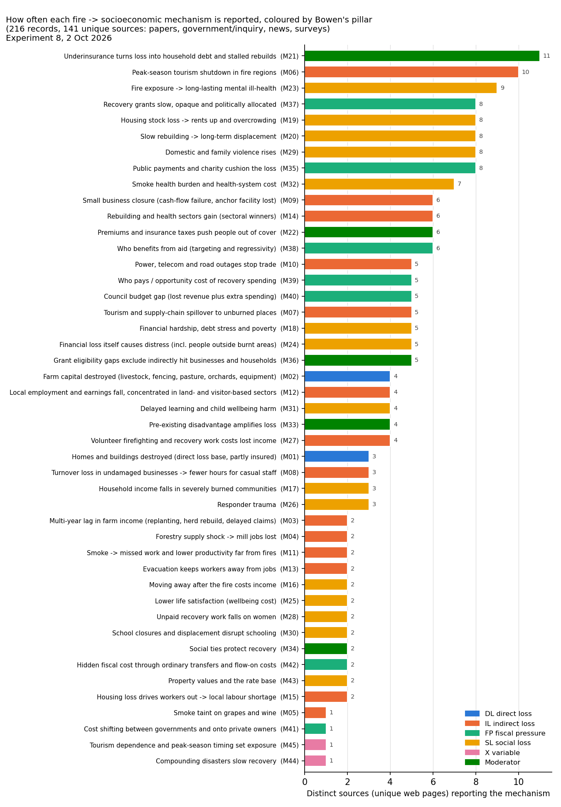

# Experiment 8: how bushfires change people's socioeconomic situation (mechanism table)

Built 2 Oct 2026 by a 10-agent workflow. Four search agents (Sonnet) each covered one source type: peer-reviewed papers,
government/inquiry/agency reports, news and first-person accounts, and surveys/interview studies. One merge agent (Opus)
turned 253 raw records into mechanisms. Four data-mapping agents (Sonnet), one per pillar group, found data for each
mechanism. One critic (Opus) checked everything. Nothing was downloaded and no statistical test was run.

**This is not a new direction.** It fills in Bowen's framework: composite Y = DL + IL + FP + SL, the X variable groups,
the council x fire panel, random forest + variable importance, the severity tiers and the pre-fire risk map. The main Y
stays the composite (see HANDOFF.md, "Main Y"). Homes destroyed is the DL pillar. Every mechanism below sits in a
pillar, or works as an X variable or a moderator, and names the Y indicator or X variable it would strengthen.

**ACM sources excluded (Ray's rule).** Australian Community Media mastheads bar AI use. The first sweep wrongly
treated "ACM" as the computing association, so 39 records from 28 ACM pages got in: Canberra Times (12), Border Mail
(3), Merimbula News Weekly, Bega District News and The Senior (2 each), and one each from The Land, Daily Advertiser,
Central Western Daily, Blue Mountains Gazette, Bendigo Advertiser, Good Fruit & Vegetables and Milton Ulladulla Times.
All of them are removed from the evidence, the counts, the ranks and the chart. Any number taken from them was replaced
with a non-ACM source already in the sweep, or dropped. One mechanism, forestry mill jobs (M04), lost all its support.
It was refilled with two ABC articles found by one extra search. The removed pages are listed in
`sources_excluded_acm.csv`. Their bibliography rows say "excluded: ACM (AI-use ban)". After exclusion: 216 records
(212 assigned to mechanisms) from 141 sources.

Files: `mechanisms.csv` (55 rows, full detail), `sources.csv` (141 unique non-ACM sources with URLs), `DATA_MAP.csv`
(158 dataset entries), `fig_mechanism_frequency.png`, `build_tables.py` (rebuilds everything from `raw/`), and
`raw/workflow_result.json` (every agent's output). Every page the agents opened or saw in search is also logged in
`../bibliography/parts/exp8_mechanisms.csv` (1,774 rows: used, opened-not-used, searched-not-used and ACM-excluded).

## Most frequent mechanisms (short summary)

How "frequency" is counted: the number of distinct sources (unique web pages) that report the mechanism. A page found
by more than one search agent counts once.

1. **Underinsurance** (11 sources; moderator). Being uninsured or underinsured turns a burned house into debt and a
   stalled rebuild. Example: about 30% of Black Saturday homes destroyed were underinsured.
2. **Peak-season tourism shutdown** (10; IL). South Coast visitor spending fell 23% in the March 2020 quarter (TRA).
3. **Long-lasting mental ill-health** (9; SL). About 1 in 5 highly exposed people were at the PTSD cut-off 12 to 18
   months later (ANU, n=3,083).
4. **Recovery grants slow, opaque and politically allocated** (8; FP). Audit Office NSW on the BLER program.
5. **Rents up and overcrowding** (8; SL). There is a +10% rent finding (Akter & Grafton). It comes from a 2016 vs 2021
   Census design that overlaps the COVID regional rent boom. Experiment 7 found no detectable council-level rent effect.
6. **Slow rebuilding means long displacement** (8; SL). Bega Valley: about 50 of 464 homes rebuilt after five years
   (SBS). This is an advocate's estimate, not an official count.
7. **Domestic and family violence rises** (8; SL). Strong in Black Saturday research. No measured NSW Black Summer
   increase was found; NSW sources only warn about it.
8. **Public payments and charity cushion the loss** (8; FP). More than A$283m in Disaster Recovery Payments.
9. **Smoke health burden** (7; SL, with smoke days as a new X). 417 excess deaths and about A$1.95b in health costs
   (MJA).
10. **Small business closure** (6; IL). 17% of small firms closed for a while (NAB survey).
    Tied at 6 sources: rebuilding and health sectors gain (IL), premiums push people out of cover (moderator) and
    who benefits from aid (FP).

By pillar (number of mechanisms / source mentions): **SL 16 / 70**, **IL 15 / 54**, **FP 9 / 35**, **moderators 7 / 28**,
DL 4 / 7, X 4 / 2. Sources talk far more about social and indirect effects than about the physical loss. Yet the
physical loss (DL) is the only pillar that Experiment 7 could see in council data.

How to read frequency: it shows what people and researchers *talk about*. It is not proof of size. News over-reports
vivid stories such as insurance fights and grant delays. Much of the "strong" quantitative evidence comes from Victoria
2009, the US or Hawaii, not NSW 2019-20.

## How this strengthens Bowen's framework

Experiment 7 showed that only DL tracks fire size. Annual, whole-council income, jobs, welfare, business and rent
figures showed no detectable effect above fairly tight bounds. The mechanism table explains why and says what to do.

The literature, the inquiries and people's own accounts agree that most socioeconomic damage runs through **specific
channels**: lost tourist seasons, uninsured homes, slow rebuilds, rent pressure, mental health, family violence, grant
gaps and council recovery bills. Each channel hits **specific groups at specific times**: renters, casual tourism
workers, women, farmers, in the 6 to 36 months after a fire. Whole-council annual averages dilute these channels until
they cannot be seen.

So the table does three things inside the existing framework:

1. **It says what each pillar should measure.**
   - IL: workplace jobs inside the fire zone and seasonal tourism loss, not resident income alone.
   - FP: grants, capital recovery spending and DRFA reimbursement, and who pays, not one annual cash number.
   - SL: rebuild rate, family violence, rent and mental health, not income proxies alone.
2. **It turns several mechanisms into X variables and moderators for the random forest, the severity tiers and the risk
   map:**
   - insurance gap
   - pre-existing disadvantage
   - tourism dependence and peak-season timing
   - non-resident (holiday) home share
   - drought
   - smoke days
   - compounding disasters

   These are exactly the "X interacts with fire" novelty in Bowen's deck.
3. **It points to finer, fire-matched data** (monthly, suburb/SA2/workplace zone) that can still be added back up to
   council x fire rows. The composite Y and the random forest keep their current form; they just get better inputs.

What the critic flagged as drift risks:
- Smoke must enter as an X variable (smoke days), not become a separate smoke-health study.
- Property values sit in SL only as household wealth.
- Mechanisms that need individual or restricted data (movers vs stayers, wellbeing, responder trauma) stay as
  literature context, not tests.

## Ranked mechanism table

Pillar shows the critic's corrected pillar. "(was X)" shows the merge agent's first choice. Evidence: *strong* means
several independent sources including quantitative ones; *moderate* means several sources or one good number; *weak*
means anecdote only. "Added after sweep" rows come from the critic's missing-mechanism check, plus M55, which Ray added.
Full numbers, caveats, data links and the Experiment 7 result for each row are in `mechanisms.csv`.

| # | Mechanism | Pillar | Sources lit/gov/news/survey = total | Time scale | Evidence | Best fine-scale data [fine-grain feasible?] | Exp 7 tested? |
|---|---|---|---|---|---|---|---|
| 1 | **Underinsurance turns loss into household debt and stalled rebuilds** (M21) | Moderator | 2/1/6/2 = **11** | 1-2 years | strong | ICA Historical Normalised Catastrophe list (claims and incurred) (eve… [no] | no |
| 2 | **Peak-season tourism shutdown in fire regions** (M06) | IL | 1/3/3/3 = **10** | months | strong | Local Government Area and Tourism Region profiles (visitor nights, sp… [partly] | partly |
| 3 | **Fire exposure -> long-lasting mental ill-health** (M23) | SL | 2/3/0/4 = **9** | 3+ years | strong | Medicare-subsidised mental health-specific services (persons and serv… [partly] | no |
| 4 | **Recovery grants slow, opaque and politically allocated** (M37) | FP | 0/4/3/1 = **8** | 1-2 years | strong | OLG Time-Series Data (Your Council), council financial data returns (… [partly] | partly |
| 5 | **Housing stock loss -> rents up and overcrowding** (M19) | SL | 3/1/2/2 = **8** | 1-2 years | moderate | Rental bond data: monthly lodgements (dwelling type, weekly rent, bed… [yes] | tested: not detected |
| 6 | **Slow rebuilding -> long-term displacement** (M20) | SL | 1/2/4/1 = **8** | 3+ years | moderate | Building Approvals by SA2 and above (dwelling units, value; monthly C… [partly] | no |
| 7 | **Domestic and family violence rises** (M29) | SL | 1/2/2/3 = **8** | 1-2 years | moderate | Quarterly recorded crime dataset by Suburb (62 offences incl. domesti… [yes] | no |
| 8 | **Public payments and charity cushion the loss** (M35) | FP (was Moderator) | 0/4/1/3 = **8** | months | moderate | Location-Based Disaster Assistance Payments (AGDRP, DRA, DRFA measure… [partly] | tested: DETECTED |
| 9 | **Smoke health burden and health-system cost** (M32) | SL | 2/2/1/2 = **7** | days-weeks | strong | NSW Air Quality monitoring network data download and Data Explorer (P… [yes] | no |
| 10 | **Small business closure (cash-flow failure, anchor facility lost)** (M09) | IL | 1/1/2/2 = **6** | 1-2 years | moderate | Counts of Australian Businesses incl. Entries and Exits (CABEE) (SA2… [yes] | tested: not detected |
| 11 | **Rebuilding and health sectors gain (sectoral winners)** (M14) | IL | 5/1/0/0 = **6** | 1-2 years | moderate | Building Approvals, Australia (SA2 data cubes) (SA2 (and LGA), monthl… [yes] | tested: not detected |
| 12 | **Premiums and insurance taxes push people out of cover** (M22) | Moderator | 0/4/1/1 = **6** | 3+ years | moderate | Property Insurance Affordability (illustrative postcode premium mappi… [no] | no |
| 13 | **Who benefits from aid (targeting and regressivity)** (M38) | FP | 3/1/2/0 = **6** | 1-2 years | moderate | Location-Based Disaster Assistance Payments (AGDRP, Disaster Recovery… [partly] | partly |
| 14 | **Power, telecom and road outages stop trade** (M10) | IL | 1/3/1/0 = **5** | days-weeks | strong | Impact of 2019-20 bushfires on telecommunications networks (outage re… [partly] | no |
| 15 | **Who pays / opportunity cost of recovery spending** (M39) | FP | 1/3/1/0 = **5** | 3+ years | strong | Disaster Recovery Funding Arrangements (DRFA) cash estimates by state… [no] | no |
| 16 | **Council budget gap (lost revenue plus extra spending)** (M40) | FP | 2/1/1/1 = **5** | 3+ years | strong | OLG Time-Series Data (Your Council): rates, user charges, grants, exp… [partly] | tested: not detected |
| 17 | **Tourism and supply-chain spillover to unburned places** (M07) | IL | 2/2/0/1 = **5** | months | moderate | Tourism Region profiles (visitor spend, nights) (Tourism region (~12… [partly] | no |
| 18 | **Financial hardship, debt stress and poverty** (M18) | SL | 2/1/0/2 = **5** | 1-2 years | moderate | DSS Benefit and Payment Recipient Demographics (incl. Commonwealth Re… [partly] | partly |
| 19 | **Financial loss itself causes distress (incl. people outside burnt areas)** (M24) | SL | 1/1/1/2 = **5** | 1-2 years | moderate | DSS payment demographics (income-support recipients) (postcode, LGA,… [partly] | no |
| 20 | **Grant eligibility gaps exclude indirectly hit businesses and households** (M36) | Moderator | 0/1/1/3 = **5** | months | moderate | Performance audit report: Bushfire recovery grants (program totals an… [no] | no |
| 21 | **Farm capital destroyed (livestock, fencing, pasture, orchards, equipment)** (M02) | DL | 1/1/0/2 = **4** | 1-2 years | strong | Value of Agricultural Commodities Produced 2020-21 (livestock numbers… [partly] | partly |
| 22 | **Local employment and earnings fall, concentrated in land- and visitor-based sectors** (M12) | IL | 3/0/0/1 = **4** | 1-2 years | strong | Jobs in Australia (employee jobs and wages, place of work, by industr… [yes] | tested: DETECTED |
| 23 | **Delayed learning and child wellbeing harm** (M31) | SL | 1/2/0/1 = **4** | 3+ years | strong | ACARA My School NAPLAN results by school (extract via Data Access Pro… [partly] | no |
| 24 | **Pre-existing disadvantage amplifies loss** (M33) | Moderator | 3/1/0/0 = **4** | 3+ years | strong | SEIFA 2021 (IRSD, IRSAD, IER, IEO) at SA1, SA2, postcode, LGA (SA1, S… [yes] | partly |
| 25 | **Volunteer firefighting and recovery work costs lost income** (M27) | IL (was SL) | 1/1/0/2 = **4** | months | moderate | NSW RFS annual reports (volunteer numbers) (state/district, annual) [no] | no |
| 26 | **Homes and buildings destroyed (direct loss base, partly insured)** (M01) | DL | 1/2/0/0 = **3** | days-weeks | strong | NSW RFS Building Impact Assessment reports and property-loss releases… [partly] | tested: DETECTED |
| 27 | **Turnover loss in undamaged businesses -> fewer hours for casual staff** (M08) | IL | 0/1/1/1 = **3** | months | strong | Retail Trade, Australia / Monthly Household Spending Indicator (state… [partly] | partly |
| 28 | **Household income falls in severely burned communities** (M17) | SL | 1/0/1/1 = **3** | 3+ years | moderate | Census DataPacks GCP: household and personal weekly income, SA1 (SA1… [partly] | partly |
| 29 | **Responder trauma** (M26) | SL | 1/0/0/2 = **3** | 1-2 years | moderate | NSW RFS annual reports (membership, brigades, districts) (state, some… [no] | no |
| 30 | **Multi-year lag in farm income (replanting, herd rebuild, delayed claims)** (M03) | IL | 0/0/2/0 = **2** | 3+ years | moderate | Value of Agricultural Commodities Produced (regional cubes) (SA2 (reg… [partly] | partly |
| 31 | **Forestry supply shock -> mill jobs lost** (M04) | IL | 0/0/2/0 = **2** | 3+ years | moderate | Jobs in Australia (employee jobs and wages by industry and place of w… [yes] | no |
| 32 | **Smoke -> missed work and lower productivity far from fires** (M11) | IL | 1/0/0/1 = **2** | days-weeks | moderate | NSW air quality hourly PM2.5 by station (station (~50-90), hourly) [yes] | no |
| 33 | **Evacuation keeps workers away from jobs** (M13) | IL | 1/1/0/0 = **2** | days-weeks | moderate | Emergency warnings / evacuation orders (RFS, SES, Emergency Alert arc… [partly] | no |
| 34 | **Moving away after the fire costs income** (M16) | SL | 2/0/0/0 = **2** | 1-2 years | moderate | Census DataPacks: usual address 1 year / 5 years ago (UAI1P, UAI5P, P… [partly] | partly |
| 35 | **Lower life satisfaction (wellbeing cost)** (M25) | SL | 0/0/0/2 = **2** | 1-2 years | moderate | HILDA Survey (life satisfaction) (state; SA4 only in restricted relea… [no] | no |
| 36 | **Unpaid recovery work falls on women** (M28) | SL | 1/0/1/0 = **2** | 1-2 years | moderate | Census GCP: unpaid domestic work hours by age by sex (SA1 and SA2) (S… [partly] | no |
| 37 | **School closures and displacement disrupt schooling** (M30) | SL | 1/1/0/0 = **2** | months | moderate | NSW government school enrolments by head count (by school) (school (w… [partly] | no |
| 38 | **Social ties protect recovery** (M34) | Moderator | 0/1/0/1 = **2** | 3+ years | moderate | Census 2021 G23 Voluntary work for an organisation or group by age by… [yes] | no |
| 39 | **Hidden fiscal cost through ordinary transfers and flow-on costs** (M42) | FP | 1/1/0/0 = **2** | 3+ years | moderate | DSS Payment Demographic Data (quarterly) (SA2, postcode, LGA, elector… [yes] | tested: not detected |
| 40 | **Property values and the rate base** (M43) | SL (was FP) | 1/0/0/1 = **2** | 3+ years | moderate | NSW Valuer General Bulk Property Sales Information (PSI) (individual… [yes] | partly |
| 41 | **Housing loss drives workers out -> local labour shortage** (M15) | IL | 0/0/2/0 = **2** | 1-2 years | weak | Internet Vacancy Index (regional, by occupation) (ABS regions (large,… [yes] | partly |
| 42 | **Smoke taint on grapes and wine** (M05) | IL | 1/0/0/0 = **1** | months | moderate | National Vintage Report (crush by Geographical Indication region) (GI… [partly] | no |
| 43 | **Cost shifting between governments and onto private owners** (M41) | FP | 0/1/0/0 = **1** | 3+ years | moderate | DRFA Activation History by LGA (LGA, per event) [partly] | partly |
| 44 | **Tourism dependence and peak-season timing set exposure** (M45) | X | 0/0/0/1 = **1** | months | moderate | Census 2021 DataPacks: industry of employment (accommodation and food… [yes] | partly |
| 45 | **Compounding disasters slow recovery** (M44) | X (was Moderator) | 0/0/1/0 = **1** | 1-2 years | weak | DRFA Activation History by LGA (LGA, per event (dates)) [yes] | partly |
| 46 | **Deaths and injuries** (M46) | DL | added after sweep |  | not swept | - | no |
| 47 | **Public infrastructure and council assets damaged** (M47) | DL | added after sweep |  | not swept | - | no |
| 48 | **Destroyed homes owned by non-residents (holiday homes)** (M48) | X | added after sweep |  | not swept | ABS Census 2016 GCP DataPack: unoccupied private dwellings by SA1/SA2… | no |
| 49 | **Insurance payouts as a local money inflow** (M49) | Moderator | added after sweep |  | not swept | - | no |
| 50 | **Concurrent drought amplifies and confounds farm loss** (M50) | X | added after sweep |  | not swept | - | no |
| 51 | **Government-funded clean-up and debris removal** (M51) | FP | added after sweep |  | not swept | - | no |
| 52 | **Park, forest and road closures extend tourism loss** (M52) | IL | added after sweep |  | not swept | - | no |
| 53 | **Aboriginal cultural and Country loss** (M53) | SL | added after sweep |  | not swept | - | no |
| 54 | **Bank hardship deferrals hide financial stress** (M54) | Moderator | added after sweep |  | not swept | - | no |
| 55 | **Capital recovery spending and disaster grants / DRFA reimbursement** (M55) | FP | added after sweep |  | not swept | NSW council audited financial statements + Quarterly Budget Review St… | no |

## What the critic changed or warned about

- **Pillar fixes applied:**
  - M27 volunteer time lost: SL to IL (lost labour).
  - M35 disaster payments: moderator to FP (public spending).
  - M43 property values: FP to SL. NSW rates are pegged, so a price change moves rates between ratepayers rather than
    cutting council revenue.
  - M44 compounding disasters: moderator to X.
- **Added mechanisms** (no sweep count): deaths and injuries (DL); public infrastructure damage (DL, with the cost in
  FP); holiday-home share (X); insurance payouts as money flowing into the area (moderator); drought (X); government
  clean-up (FP); park and forest closures (IL); Aboriginal cultural and Country loss (SL, note only); bank hardship
  deferrals (moderator).
- **M55 (FP), from Ray: capital recovery spending and disaster grants / DRFA reimbursement.** Data: council audited
  financial statements (capital purchases in the cash-flow statement, natural-disaster grant lines in the grants note)
  and Quarterly Budget Review Statements. **Other sessions are collecting these in Experiment 10, so they are not
  duplicated here.**
- **Evidence downgraded to "moderate":**
  - M07 tourism spillover: the number comes from an input-output model, not observation.
  - M19 rents: confounded with the COVID rent boom.
  - M20 rebuild: the figure is an advocate's estimate.
  - M29 family violence: the evidence is from Black Saturday, not NSW 2019-20.
- **Other caveats are in the `critic_note` column**:
  - national vs NSW insurance totals (M01);
  - conflicting livestock counts (M02);
  - Victorian 2009 sector income numbers (M12);
  - an advocacy poll on missed work (M11);
  - disputed grant-delivery figures (M37);
  - Experiment 7 not reproducing "disadvantage amplifies" at area level (M33).

**Data warnings (important before any test):**
- ABS *Jobs in Australia* regional data are, as far as the critic knows, coded to where the worker *lives*, not where
  they work. Jobs located inside a fire zone therefore need Census Place of Work (destination zones, 2016/2021 only).
  This needs checking on the ABS methodology page.
- *Every 2016 vs 2021 Census comparison mixes the fire with COVID.* Use 2016 only as a fixed pre-fire weight.
- AIHW mental-health data (annual, SA3) and HealthStats ED data (health district) are too coarse to match to a fire.
- Paid or restricted data are not counted as available: Spendmapp, CoreLogic, HILDA, NAPLAN extracts, ICA postcode
  claims, outage data.
- TableBuilder needs a free account that Ray must create himself.
- Several dataset sizes are unconfirmed (see `DATA_MAP.csv`).

## Proposal: 3 targeted tests (not run; waiting for Ray)

All three cut data into fire-matched pieces: fire outline x fire month. Each result is added back up to the existing
council x fire rows, so it becomes a new or better **Y indicator** (or X variable) inside the composite Y and the
random forest. None repeats an Experiment 7 annual whole-area test. Each would get a PRESPEC that is hash-locked before
running.

### Test 1. Family violence after fires: monthly event study (SL)
- **Mechanism / pillar:** M29 (+ M24 financial distress). New SL indicator: *domestic-violence-related assaults per
  1,000 residents, months +6 to +24 vs months -24 to -1.* It is the first SL indicator that is not an income proxy.
  Experiment 7 never tested it.
- **Data:** BOCSAR recorded crime, monthly counts by offence. The LGA file matches the panel geography; the suburb file
  is an optional finer cut. Population (ERP) and the fire dates / homes destroyed are already in the project.
- **Fire-matched pieces:**
  - Use every fire in the 2015-2025 council x fire panel, not only Black Summer, so the COVID months do not dominate.
  - Month 0 is the fire month; the window runs from 24 months before to 24 months after.
  - Exposure is homes destroyed per 1,000 dwellings.
  - The comparison is unburned councils in the same months, plus each council's own seasonal pattern.
  - The outcome nets out non-domestic assault as a control offence, which removes general policing changes.
  - Placebo: the same test with fire dates moved back 3 years.
  - Optional: suburbs inside vs outside the outline within the same council.
- **Gap-filling:** Very little is needed, because BOCSAR lists zeros. Small councils are pooled into 3-month windows
  and analysed with a count model. The population between June estimates is interpolated (a stated rule).
- **Expected direction:** Higher DV rates where more homes were lost, 6 to 24 months after the fire. There may be a dip
  in months 0 to 2, when services and roads are cut. DV is under-reported, so a null result means "no detectable
  increase above X", not "none".
- **Files:**
  - BOCSAR `RCI_offencebymonth.xlsm`, LGA x offence x month, from
    https://www.bocsar.nsw.gov.au/Documents/Datasets/RCI_offencebymonth.xlsm. **Size not confirmed** (the agents'
    fetch was blocked); likely about 5-30 MB.
  - Optional: `SuburbData.zip` (same site), size not confirmed, likely tens of MB.

### Test 2. Rebuild gap: how many destroyed homes come back, and how fast (SL, links DL to SL)
- **Mechanism / pillar:** M20 slow rebuild (+ M19 rents, M14 builders gain, M21 underinsurance as moderator). New SL
  indicator: *share of destroyed homes with a new-dwelling approval after 12 / 24 / 36 months.* It turns the one
  pillar that does track fire size (DL) into a recovery-time measure for the severity tiers. Experiment 7 measured
  homes destroyed and construction income, but never rebuilding.
- **Data:**
  - ABS Building Approvals by SA2, monthly (new houses).
  - Experiment 7's SA2 "homes inside fire" estimate and the council homes-destroyed figures (already in the project).
  - Second outcome: NSW Fair Trading new-bond rents by postcode and month.
- **Fire-matched pieces:**
  - Burned SA2s, month 0 = fire month, window -24 to +48 months.
  - Outcome: cumulative extra approvals, compared with the SA2's own pre-fire average and with unburned SA2s in the
    same SA4 over the same months, divided by the estimated homes destroyed in that SA2.
  - Rents: postcode-month medians over -12 to +36 months against unburned postcodes in the same SA4.
- **Gap-filling:** Homes destroyed per SA2 = Experiment 7's homes-inside-fire share scaled to the RFS council total
  (an existing, stated rule). Approvals include builds that are not rebuilds, so the result is an upper bound on the
  rebuilt share. Postcode-months with fewer than 10 bonds use 3-month rolling medians.
- **Expected direction:** Extra approvals start rising from about month 6. They stay well under 1 per destroyed home by
  month 36. Rebuilding is slower in poorer SA2s. Rents rise only in small, high-loss postcodes, within 6 to 18 months.
- **Files:**
  - ABS Building Approvals SA2 monthly (data.gov.au dataset 475e832b-... or the ABS data cubes), about 5-30 MB in
    total, **unconfirmed**. Check the ASGS 2016 vs 2021 boundary edition.
  - Rental bonds: first check whether Experiment 7's council rent build kept the postcode-month file. If not, the NSW
    Fair Trading annual lodgement files are about 7-8 MB per year (2019-2023, about 40 MB). Older monthly files may need
    the data.nsw.gov.au archive.
- **Main risk:** COVID-era building programs (HomeBuilder) and the 2021-22 cost surge lifted approvals everywhere; the
  comparison SA2s must absorb this. Holiday-home owners who do not rebuild look like "displacement".

### Test 3. Jobs located inside the fire zone, followed to where those workers live (IL)
- **Mechanism / pillar:**
  - M12 local jobs and earnings, M06 tourism shutdown, M08 casual hours and M09 business closure, with M48
    holiday-home share and M45 tourism dependence as pre-specified moderators.
  - New IL indicator: *jobs at workplaces inside the fire outline, by industry, per 1,000 local jobs.*
  - This is Ray's seed idea. It sharpens Experiment 7's only detected income result (SA2 total income -1.6% per 10pp
    at year 2, mostly fewer earners) by measuring exposure where people *work*, not only where they live.
- **Data:**
  - ABS Census 2016 working population by destination zone (place of work) and industry: the pre-fire weight.
  - Destination-zone boundaries (ASGS 2016).
  - Journey-to-work flows, home SA2 x work destination zone (TableBuilder; Ray creates the free account).
  - Census 2016 GCP SA2 unoccupied-dwelling share (holiday homes).
  - Outcomes already in the project: Experiment 7 SA2 earners, total income and unemployment panels.
- **Fire-matched pieces:**
  1. For each fire, find the 2016 destination zones that fall inside the outline, or the share of each zone's area
     inside it.
  2. Count the jobs there by industry.
  3. Use journey-to-work to send those exposed jobs back to the workers' home SA2s. This gives "exposed jobs per 100
     resident workers" for every SA2, including unburned SA2s where commuters live (the spillover channel).
  4. Rerun the Experiment 7 Day 9 SA2 x year design with this exposure, keeping its placebo.
  5. Add interactions with holiday-home share and tourism share.
- **Gap-filling:** Jobs inside a partly burned zone = zone jobs x share of the zone's mesh-block dwellings or area
  inside the outline (transparent, like the homes-inside-fire estimate). 2016 weights are fixed (no 2021 data, to
  avoid COVID).
- **Expected direction:**
  - A larger fall in earners in home SA2s with more exposed jobs, strongest for accommodation and food work and for
    December-January fires.
  - A smaller resident effect per home lost where many lost homes were holiday homes.
  - Some loss shows up in unburned commuter SA2s.
- **Files:**
  - ABS 2016 Census DataPacks: Working Population Profile for NSW by destination zone (**size unconfirmed**; one
    agent could not find a WPP pack on the current DataPacks page, so TableBuilder may be needed instead).
  - ASGS 2016 destination-zone boundaries for NSW (unconfirmed, likely about 10-50 MB).
  - TableBuilder export, home SA2 x work destination zone for NSW fire regions (small CSV, needs Ray's account).
  - 2016 GCP NSW SA2 DataPack (about 15-30 MB, unconfirmed). Only the LGA files are in
    `fire_event_dataset/data/abs/gcp2016` now.
- **Main risk:** About 57 to 72 treated SA2s, mostly from one season, so the answer may be "cannot tell" (bounds will
  be reported). Workplace data are Census years only.

**Not proposed as a test here:** FP capital recovery spending / DRFA (M55) is being built in Experiment 10. When ready,
it should feed the FP pillar directly. Mental health (M23), the third most-reported mechanism, has no open data finer
than annual SA3, so it stays literature-only for now.

**What I need from Ray:**
1. Which tests to run (1, 2, 3, or a subset).
2. OK to download the files listed above (sizes get checked first; nothing is downloaded yet).
3. For Test 3: whether he will create a free ABS TableBuilder account.

## Limits of this sweep

- About 40 of 189 pages the agents tried to open failed (403 errors, timeouts). Those records rest on search-result
  summaries and are marked in `sources.csv` (`opened_by_agent`, `fetch_possibly_failed`).
- The search tool blocked the Guardian and SMH, so no articles from those two are included.
- Frequencies depend on what four agents found in one pass. They show *relative attention*, not a complete census of
  the literature.
- Some studies appear via secondary pages, e.g. Akter & Grafton via PreventionWeb and The Conversation. Before citing
  their numbers in the report, check the original paper.
