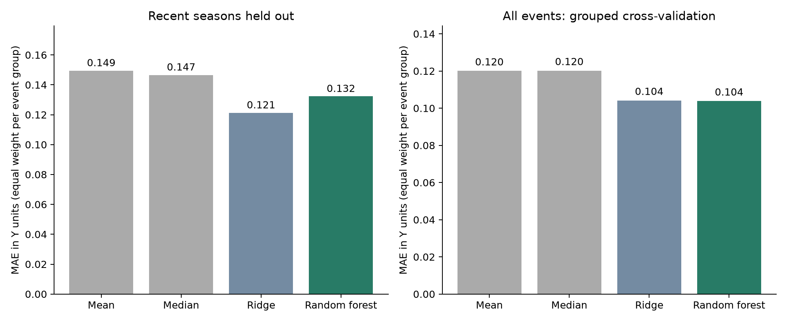
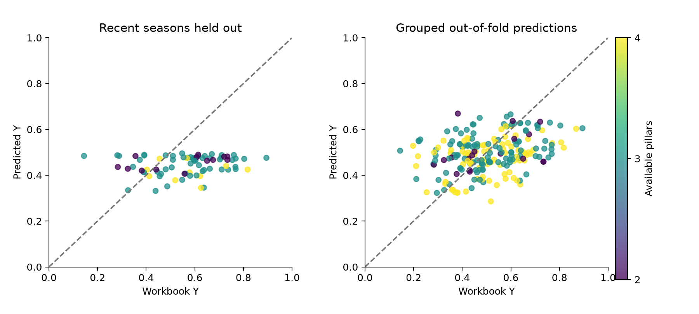

# Bowen random-forest experiment V1

Completed 28 September 2026. Input: the user-selected Drive workbook, `master` sheet.

The frozen experiment did not establish transferable predictive gain over the simple baselines. On the recent-season holdout, RF group MAE was **0.1323**, versus **0.1213** for the strongest baseline (ridge); the RF improvement was **-9.1%**. This is a result for the supplied reference-cohort Y, not a claim about all fires or independently validated economic loss.

## What was tested

One row is a declared event × council. The 218 rows cover 96 declarations and 69 councils, but shared fires, overlapping declarations and reused council-FY outcomes join them into 49 connected groups. The largest is 67 rows and spans FY2018–FY2019, including Black Summer. These are dependency groups, not 49 certified independent fire episodes. There are no event-start rows in calendar years 2020–2022 in this master view; the results must not be advertised as uniform coverage of every fire in 2015–2025.

Y is preserved byte-for-byte numerically from the workbook. Its core indicators are homes lost per 1,000 dwellings (DL); excess total personal-income and business-count falls (IL); excess cash-cover drawdown, services crowd-out and renewals-ratio rise (FP); excess income-support-recipient rise (SL). Each is percentile-ranked, ranks are averaged into pillars, and available pillars are averaged into Y. 84 rows have four pillars, 116 have three and 18 have two. Missing outcomes were not imputed. This changes the effective weights and is part of the existing definition.

The regression predicts Y. Predicted classes come from the fixed reference boundaries **0.486631, 0.635393, 0.754397**. They reproduce `Y_class_from_Y`. The separate `Y_class` includes death/home-loss floors and differs in 23 rows; those outcome-derived overrides are not predicted or applied.

## Validation design

The primary temporal holdout trains on 139 rows from complete groups ending no later than FY2019 and tests 79 rows from groups beginning in FY2022 or later. The latest training t+1 outcome FY ends 30 June 2021. No held-out declaration, linked mapped fire or council-FY outcome group appears in training. There are 15 test rows from councils absent from training; the remaining test councils recur. This tests new events, not exclusively new councils.

The secondary five-fold grouped cross-validation predicts every row once out of fold. It is a cross-event benchmark with no time ordering. In both designs, each outer training set uses four-fold grouped inner tuning. All numerical imputation, categorical encoding, constant/duplicate removal and coverage screening are learned from training cells only. Model fitting and primary MAE give each connected group equal total weight. Row metrics are also reported.

Candidates were the 223 codebook X columns. Two long-window GRP-growth predictors were excluded. Later source reference years were masked only in the experiment copy. Within training, a column needed >=50% coverage and nonconstant values; exact duplicates were dropped. The primary forest retained **211** original features. It uses 500 trees and the frozen selected settings `{"min_samples_leaf": 15, "max_features": 0.33}`. Predictor IDs, Y ingredients, impact-side columns, class labels and pillar availability were excluded. The forest is a retrospective post-fire estimator; final area and mapped severity were available as inputs. It is not an early-warning system.

## Recent seasons held out

| Model | Group MAE | Row MAE | RMSE | R² | Class accuracy | Macro-F1 |
|---|---:|---:|---:|---:|---:|---:|
| mean | 0.1495 | 0.1753 | 0.2063 | -0.956 | 30.4% | 0.117 |
| median | 0.1466 | 0.1720 | 0.2025 | -0.884 | 30.4% | 0.117 |
| ridge | 0.1213 | 0.1287 | 0.1683 | -0.301 | 40.5% | 0.291 |
| rf | 0.1323 | 0.1611 | 0.1893 | -0.646 | 29.1% | 0.137 |

Positive differences below favour RF. Intervals resample whole held-out groups and condition on the already-fitted models; they do not represent all model-selection uncertainty.

- Versus mean: +11.5% improvement; group-MAE difference +0.0172, conditional 95% interval [+0.0026, +0.0308].
- Versus median: +9.8% improvement; group-MAE difference +0.0143, conditional 95% interval [+0.0004, +0.0273].
- Versus ridge: -9.1% improvement; group-MAE difference -0.0110, conditional 95% interval [-0.0425, +0.0182].

## All rows: grouped cross-validation

| Model | Group MAE | Row MAE | RMSE | R² | Class accuracy | Macro-F1 |
|---|---:|---:|---:|---:|---:|---:|
| mean | 0.1200 | 0.1224 | 0.1503 | -0.091 | 37.6% | 0.157 |
| median | 0.1202 | 0.1276 | 0.1580 | -0.205 | 49.5% | 0.166 |
| ridge | 0.1041 | 0.1127 | 0.1403 | 0.049 | 47.2% | 0.284 |
| rf | 0.1038 | 0.1142 | 0.1414 | 0.034 | 41.7% | 0.232 |

## Classes derived from predicted Y

These are the four reference-relative classes. Extreme-class recall remains visible even when poor.

| Test | Actual class | Rows | RF recall |
|---|---:|---:|---:|
| Recent-season holdout | 1 | 24 | 87.5% |
| Recent-season holdout | 2 | 30 | 6.7% |
| Recent-season holdout | 3 | 17 | 0.0% |
| Recent-season holdout | 4 | 8 | 0.0% |
| Grouped cross-validation | 1 | 108 | 52.8% |
| Grouped cross-validation | 2 | 66 | 51.5% |
| Grouped cross-validation | 3 | 33 | 0.0% |
| Grouped cross-validation | 4 | 11 | 0.0% |

Full confusion counts are in `results/CLASS_CONFUSION.csv`. Regression is primary; class conversion is secondary. Thresholds were fixed from the supplied workbook before fitting and were not optimised on prediction accuracy.

## Exploratory diagnosis after the frozen test

The primary RF predictions occupy only **0.332–0.495**, although actual held-out Y occupies **0.144–0.894**. Its highest prediction is below the severe-class boundary, so it misses every severe and extreme row. Ridge's range is wider, but its held-out R² is also negative. The data have not established a dependable recent-season predictor.

| Cohort | Rows | Median Y | Rows with four pillars | Severe/extreme from Y |
|---|---:|---:|---:|---:|
| Older training rows | 139 | 0.461 | 74 | 19 |
| Recent held-out rows | 79 | 0.583 | 10 | 25 |

This is an exploratory explanation check, not an additional model or an attribution of cause. The recent cohort has a higher target distribution and much less four-pillar coverage. Missing-pillar reweighting may contribute to differences between cohorts, but this table does not establish that it caused the prediction failure. `COHORT_DIAGNOSTICS.csv` gives the FY detail. Review the comparability and interpretation of Y with Bowen before choosing a new model or changing the target.

## Interpretation

The prespecified success rule requires at least 5% primary group-MAE gain and a positive lower bootstrap improvement bound versus **all three** baselines, plus a lower grouped-CV MAE versus all three. Verdict: **PREDICTIVE_GAIN_NOT_ESTABLISHED**. No model grid, target or subset was changed after seeing predictive results. A no-gain result is about this benchmark and design; it does not imply that fires have no socioeconomic effect.

Highest descriptive permutation scores on the primary held-out set:

- `X_socio_population_density_pre`: held-out group MAE increase 0.0006.
- `X_fire_severity_share_low_wmean`: held-out group MAE increase 0.0005.
- `X_socio_pop_density`: held-out group MAE increase 0.0005.
- `X_socio_pop_within_5km`: held-out group MAE increase 0.0005.
- `X_socio_pia_own_biz_income_earners_pre`: held-out group MAE increase 0.0004.
- `X_socio_pop_within_5km_all_councils`: held-out group MAE increase 0.0003.
- `X_socio_pia_own_biz_income_median_pre`: held-out group MAE increase 0.0002.
- `X_council_grants_per_capita_aud_pre`: held-out group MAE increase 0.0001.

These scores describe predictive reliance, not causal mechanisms or validated policy priorities. Correlated variables can substitute for one another. Row-wise permutations can produce implausible combinations and retain repeated group structure; use these only as exploratory interpretation. They were not used for model selection.

## Limits that remain

- Labels were constructed using percentile ranks over the full workbook reference cohort. They were preserved by explicit user choice. This is a frozen-index benchmark, not a fully forward-built target or independent validation of Y.
- Pillar coverage varies, with homes lost known for only 90 rows. Sensitivity by two/three/four pillars is saved in `ROBUSTNESS_RESULTS.csv`; it does not redefine Y.
- Annual LGA outcomes can dilute fire effects and repeat across events. Shared comparison benchmarks, temporal overlap of adjacent years and statewide shocks can leave dependence beyond the grouping used here.
- The oldest and newest cohorts have different source coverage. Source reference years are checked, but exact historical publication dates and later revisions are not certified. Future-looking benchmark performance is therefore conditional on retrospective measurements, not a proven operational forecast.
- The sample is a selected declared-event view with mapped-fire links, not the entire official inventory. There are 125 declarations in the workbook inventory, 96 represented in the master, and 6,146 fires in the separate inventory.
- Group bootstrap intervals are conditional and based on a limited number of groups. The workbook index is relative severity, not dollars and not a causal effect.

## Reproduction and saved outputs

The frozen workbook hash is `123423eaed7174987f72c63cc40ad334e26c636b2e28358f94cf4fcd60c32ec3`. Before-fit protocol, source, runner and split hashes are in `PRE_FIT_RECEIPT.json`; runtime versions and completion status are in `RUN_RECEIPT.json`. Validation: **PASS — 25/25 checks**. The original Drive file was unchanged.

`results/HELD_OUT_PREDICTIONS.csv` contains actual Y, each model's prediction, RF-derived class and group for every test row. `MODEL_RESULTS.csv`, `PAIRED_GROUP_BOOTSTRAP.csv`, `INNER_TUNING.csv`, `SELECTED_MODELS.csv`, `FEATURE_DECISIONS.csv`, `AVAILABILITY_RULES.csv`, `ROBUSTNESS_RESULTS.csv` and `CLASS_CONFUSION.csv` expose the full experiment. `RF_MODEL.joblib` is a standard sklearn primary-training model bundle. It is labelled experimental and has not been refitted on the test rows.

Recreate an isolated Python environment with `requirements.txt`, run `prepare.py` on a fresh experiment copy, then `run_experiment.py` and `validate_and_report.py`. The runner refuses to overwrite a completed V1 receipt. No canonical database is a model input.

Methods: [random forest regression](https://scikit-learn.org/stable/modules/generated/sklearn.ensemble.RandomForestRegressor.html), [grouped validation](https://scikit-learn.org/stable/modules/cross_validation.html), [training-only preprocessing](https://scikit-learn.org/stable/common_pitfalls.html).
