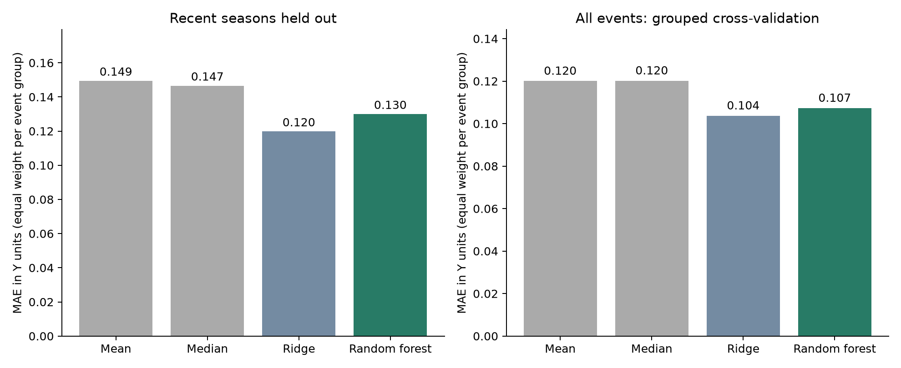
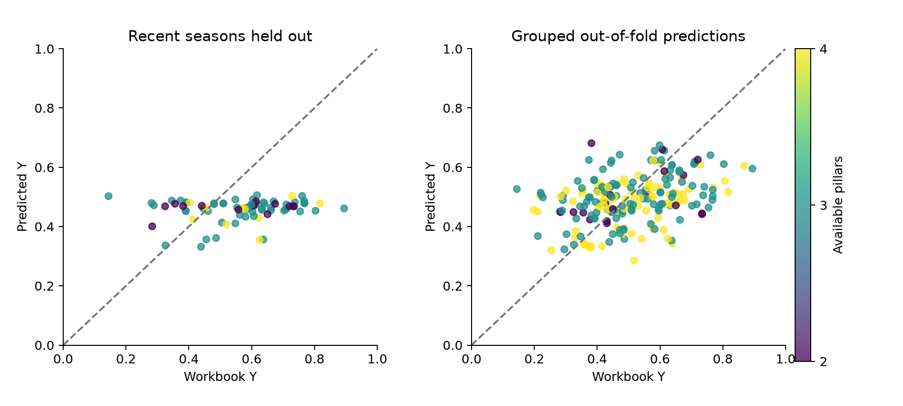

# Bowen random-forest amended benchmark V2

Completed 28 September 2026. **The amended run does not establish RF predictive gain against all simple baselines.** Recent-season RF group MAE is **0.1300**; the lowest point-estimate group MAE is **0.1198** (ridge). The saved data and models pass the specified correction checks. This verifies the repairs and recorded arithmetic; it does not certify Y or provide fresh independent validation.

V2 follows the user's request to fix the V1 audit findings and check again. It preserves the Drive `master` workbook, continuous Y, Y-derived class thresholds, all 218 observations, all 49 connected groups, and identical outer splits. The protocol and source registry were frozen before the completed V2 fit, after V1 results had already been seen. The earlier holdout is reused and must be described that way.

## Corrections implemented

- Inner tuning pools event-group errors equally across all validation folds. Independent reconstruction from saved inner predictions verifies every fold's group count, every score and every selected candidate. This corrects the overweighting of single-group folds in V1.
- All 223 X candidates have an explicit source eligibility rule. All 36 Census/SEIFA predictors, including the previously missed exposure and occupied-dwelling columns, use the row's vintage and release-date guard. Both road-exposure columns are masked before their 1 January 2019 OSM snapshot. Two RA 2021 remoteness predictors and four 2025 BCARR predictors are excluded where historical availability is unverified. The 2023 REDS product receives a conservative publication-year guard.
- Every outer training set tests all 15 RF configurations: leaf sizes [1,2,3,8,15] × feature fractions [0.33,0.7,1.0]. All use 500 trees, bootstrap, no explicit depth limit and the original seed. Deeper-tree candidates were actually fitted and grew beyond one split; their performance, rather than their availability, determines selection.
- Grouped-CV pillar sensitivities are pooled correctly for reporting. Models and Y are not selected or changed using those sensitivities.

Primary selected RF settings: `{"min_samples_leaf": 15, "max_features": 0.33}`; **208** original predictors survive training-only screening. The selected forest's median depth is **2** (range 1–2), with median **3** leaves. **196/500** trees have only one split. A regularised setting may legitimately win even when deeper settings were tested; leaf size 1 is not forced merely to improve the appearance of tree depth.

The pre-fit repairs exclude 6 candidates, leaving 217 eligible columns before fold-specific coverage/constant/duplicate screening. 2948 observed cells are masked or excluded in the experiment copy. Original cells remain preserved in the snapshot.

## Recent seasons held out

Train: 139 older rows in 25 groups. Test: 79 recent rows in 24 groups. Shared declarations, mapped fires, overlapping declarations and reused council-FY outcome windows cannot cross the outer split. Predictor imputation, categorical encoding and ridge scaling use training rows only. Each group receives equal total fitting weight; evaluation reports both equal-group and row metrics.

| Model | Group MAE | Row MAE | RMSE | R² | Class accuracy | Macro-F1 |
|---|---:|---:|---:|---:|---:|---:|
| mean | 0.1495 | 0.1753 | 0.2063 | -0.956 | 30.4% | 0.117 |
| median | 0.1466 | 0.1720 | 0.2025 | -0.884 | 30.4% | 0.117 |
| ridge | 0.1198 | 0.1289 | 0.1699 | -0.326 | 44.3% | 0.311 |
| rf | 0.1300 | 0.1557 | 0.1814 | -0.513 | 30.4% | 0.150 |

RF comparison intervals condition on these fitted models and resample held-out groups; they do not include full model-selection uncertainty. Positive differences favour RF. An interval crossing zero does not establish which model is generally better.

| Comparator | RF gain in group MAE | Comparator MAE minus RF MAE | Conditional 95% interval |
|---|---:|---:|---:|
| mean | +13.0% | +0.0195 | [+0.0057, +0.0315] |
| median | +11.3% | +0.0166 | [+0.0037, +0.0279] |
| ridge | -8.5% | -0.0102 | [-0.0412, +0.0200] |

## Grouped cross-validation

Five outer grouped folds, each with fresh four-fold grouped inner selection. Every observation has exactly one out-of-fold prediction. This benchmark mixes older and newer groups during training and is not a temporal forecast simulation.

| Model | Group MAE | Row MAE | RMSE | R² | Class accuracy | Macro-F1 |
|---|---:|---:|---:|---:|---:|---:|
| mean | 0.1200 | 0.1224 | 0.1503 | -0.091 | 37.6% | 0.157 |
| median | 0.1202 | 0.1276 | 0.1580 | -0.205 | 49.5% | 0.166 |
| ridge | 0.1037 | 0.1143 | 0.1460 | -0.030 | 47.7% | 0.296 |
| rf | 0.1073 | 0.1138 | 0.1396 | 0.058 | 43.6% | 0.243 |

## What changed from V1

These comparisons use the same observations, Y and outer split memberships. Changes combine the corrected eligibility, corrected tuning objective and expanded RF grid; they do not identify each correction's separate causal contribution.

| Evaluation | Model | V1 group MAE | V2 group MAE | V2 R² | V2 class accuracy |
|---|---|---:|---:|---:|---:|
| Recent seasons | ridge | 0.1213 | 0.1198 | -0.326 | 44.3% |
| Recent seasons | rf | 0.1323 | 0.1300 | -0.513 | 30.4% |
| Grouped CV | ridge | 0.1041 | 0.1037 | -0.030 | 47.7% |
| Grouped CV | rf | 0.1038 | 0.1073 | 0.058 | 43.6% |

## Classes from continuous predictions

Class boundaries remain 0.4866308906879208, 0.6353925611165694 and 0.7543974862033601. These reproduce the workbook `Y_class_from_Y`. The separate home/death floors are not applied to predictions. Class performance remains visible even if regression improves.

| Evaluation | Actual class | Rows | RF recall |
|---|---:|---:|---:|
| Recent seasons | 1 | 24 | 87.5% |
| Recent seasons | 2 | 30 | 10.0% |
| Recent seasons | 3 | 17 | 0.0% |
| Recent seasons | 4 | 8 | 0.0% |
| Grouped CV | 1 | 108 | 55.6% |
| Grouped CV | 2 | 66 | 53.0% |
| Grouped CV | 3 | 33 | 0.0% |
| Grouped CV | 4 | 11 | 0.0% |

Primary RF predictions range **0.332–0.506**; observed Y ranges **0.144–0.894**. Full counts are in `CLASS_CONFUSION.csv`; no conclusions about class 3 or 4 are inferred from average regression error alone.

## Source eligibility audit

All eligibility uses source/time metadata, never Y. Census/SEIFA release dates and the conservative employment availability bound are sourced in the per-column registry. In particular, [SEIFA 2016](https://www.abs.gov.au/ausstats/abs%40.nsf/Lookup/2033.0.55.001Quality%2BDeclaration02016) was released 27 March 2018, and [SEIFA 2021](https://www.abs.gov.au/statistics/detailed-methodology-information/concepts-sources-methods/socio-economic-indexes-areas-seifa-technical-paper/2021) on 27 April 2023. The release day is masked conservatively where ignition times are absent.

| Source family | Candidate columns | Observed cells masked/excluded |
|---|---:|---:|
| fire_or_environment | 39 | 0 |
| osm_2019 | 2 | 136 |
| census_basic | 14 | 280 |
| annual_pre_event | 123 | 0 |
| seifa | 2 | 158 |
| remoteness_2021 | 2 | 436 |
| bcarr_2025 | 4 | 732 |
| reds_2023 | 1 | 189 |
| census_employment | 20 | 560 |
| tra_2014_2017 | 15 | 457 |
| fixed_geography | 1 | 0 |

`MASKED_CELLS.csv` identifies affected rows/columns, while `AVAILABILITY_RULES.csv` and `SOURCE_ELIGIBILITY_REGISTRY.csv` state the reason. Annual/quarterly historical release dates and revisions, the precise TRA publication date, and some environmental vintages remain unverified. This is a retrospective benchmark with corrected known date problems, not certification that every input was operationally available at ignition.

## Remaining measurement and evidence limits

Y is still the original equal mean of available DL/IL/FP/SL pillars; its indicators and class boundaries were ranked over the full reference cohort. This is not a target constructed without held-out outcomes. The differing pillar coverage changes effective weights and may affect comparability; it was not changed to improve prediction.

| Cohort | Rows | Median Y | Four-pillar rows | Class 3/4 rows |
|---|---:|---:|---:|---:|
| Older training | 139 | 0.461 | 74 | 19 |
| Recent test | 79 | 0.583 | 10 | 25 |

Rows are declaration × council, from a selected master view rather than all NSW fires. The 49 connected groups are dependency clusters, not certified independent disasters. Adjacent-year outcomes, shared statewide comparisons and persistent council characteristics can leave further dependence. Neither the index nor predictive associations establish causal dollar loss or policy priorities.

The diagnostic decision rule is unchanged: at least 5% primary gain versus every baseline, a positive lower conditional bootstrap difference bound versus every baseline, and lower pooled grouped-CV MAE versus every baseline. Status: **AMENDED_BENCHMARK_GAIN_NOT_ESTABLISHED**. This rule is applied once to V2. No further grid, seed, subset or target changes were made after V2 performance was observed. If the criteria were met, additional untouched data would still be required for fresh confirmation.

## Verification and reproduction

Correction verification: **PASS — 42/42 specified checks**. All 39 recorded original V1 files retain their hashes; the Drive source and snapshot still match `123423eaed7174987f72c63cc40ad334e26c636b2e28358f94cf4fcd60c32ec3`. Reported metrics and inner selections are independently recalculated; the portable saved model reproduces primary predictions and loads in a new process. These checks have defined scopes and are not scientific certification.

An initial execution was interrupted after a verification-script error included non-X codebook columns in a census check. The check was fixed, all 10 pre-fit checks passed, and the completed execution enforced that passing receipt. The incomplete files are preserved in `aborted_preflight_run`; no outer-test scores were inspected to change the grid, target, groups or eligibility. `RESTART_NOTE.md` records the restart.

For reproduction, use a fresh copy of this folder beside the preserved V1 folder, recreate `requirements.txt`, keep the snapshot and registry, run `check_repairs.py`, `run_experiment.py`, then `validate_and_report.py`. Move existing result folders aside in the reproduction copy; the runner refuses to overwrite a completed receipt. No canonical database is used. This model is trained on the older primary training rows only, is labelled experimental, and has no final all-data refit.

Key evidence: `PROTOCOL.md`, the source registry, `PRE_FIT_REPAIR_CHECKS.json`, `PRE_FIT_RECEIPT.json`, `INNER_HELD_OUT_PREDICTIONS.csv`, `INDEPENDENT_SELECTION_CHECK.csv`, `PRIMARY_CANDIDATE_COMPARISON.csv`, `PRIMARY_TREE_STRUCTURE.csv`, `HELD_OUT_PREDICTIONS.csv`, `MODEL_RESULTS.csv`, `PAIRED_GROUP_BOOTSTRAP.csv`, `ROBUSTNESS_RESULTS.csv`, `V1_V2_COMPARISON.csv`, `VALIDATION_CHECKS.json` and `RF_MODEL.joblib`.
